# HeartData
心电小程序客户端数据的服务器存储和分析

注意工程中，配置文件密码相关敏感信息已屏蔽，clone项目时需自行配置。

# 小程序系统架构

​	小程序主要分为登陆页面、主页、心电报告页面。其中主页和心电报告页面整合为带tabbar的页面。

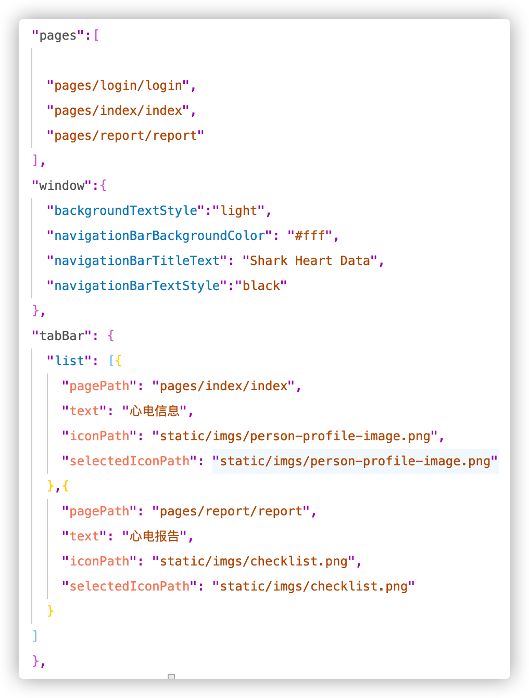

## 登陆页面

​	用来登陆小程序。

### 页面展示


### 介绍

​	登陆页面由背景图片和登录按钮组成。

- 背景图片，设置铺满全屏。

- 登陆可以设置为"用户名 + 密码"形式登陆，也可以设置为微信登陆。

  目前采用微信方式登陆，点击按钮后，弹出弹窗，授权后可以获取到微信相关的信息：微信昵称、性别、地区。

  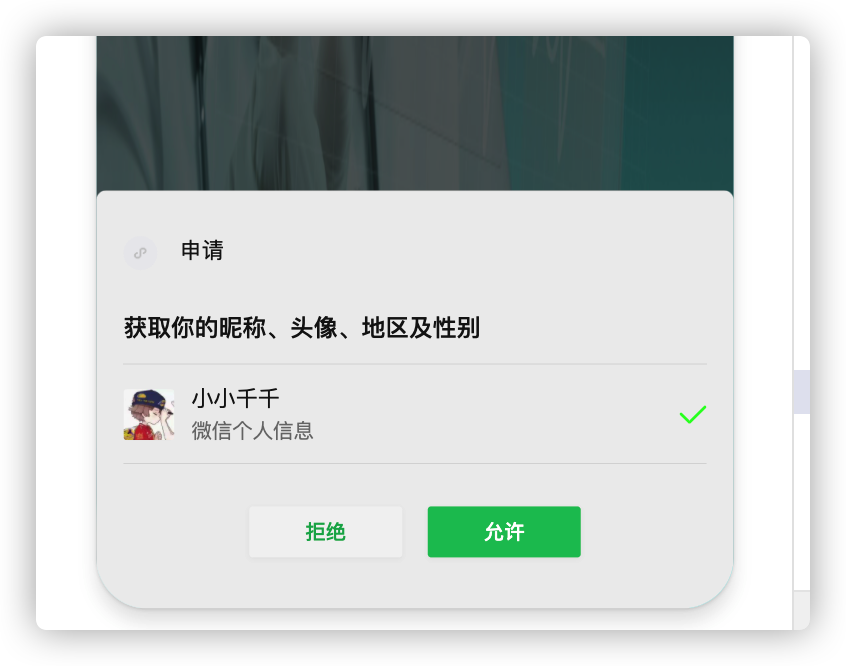

### 代码框架

- js

  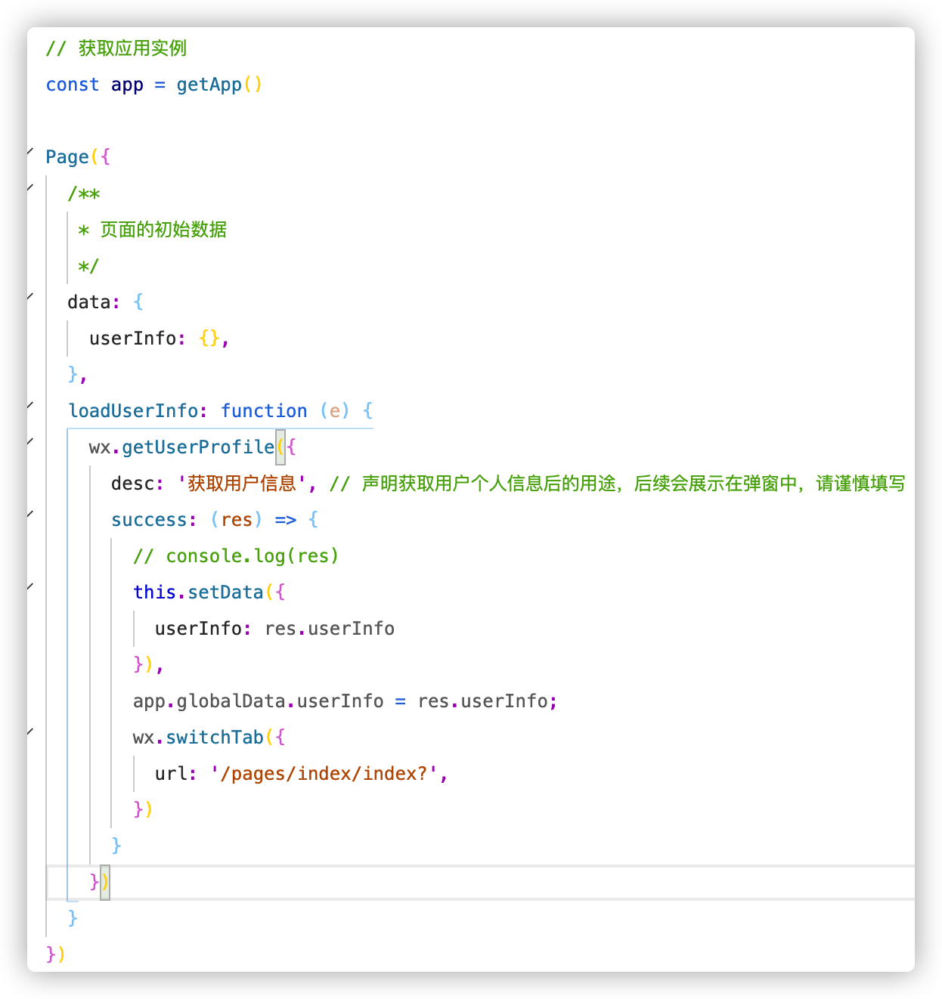

  js部分后续还要加上将登陆信息发送到服务器部分。

  如果是微信登陆，需要在第一次登陆时发送信息。

  如果时"用户名+密码"方式登陆，则在注册时发送信息到服务器。

- wxml

  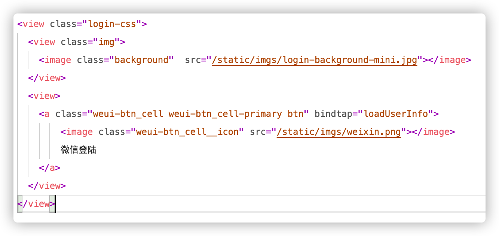

## 主页

​	展示用户信息、通过蓝牙与硬件连接、实时显示波形。

### 页面展示

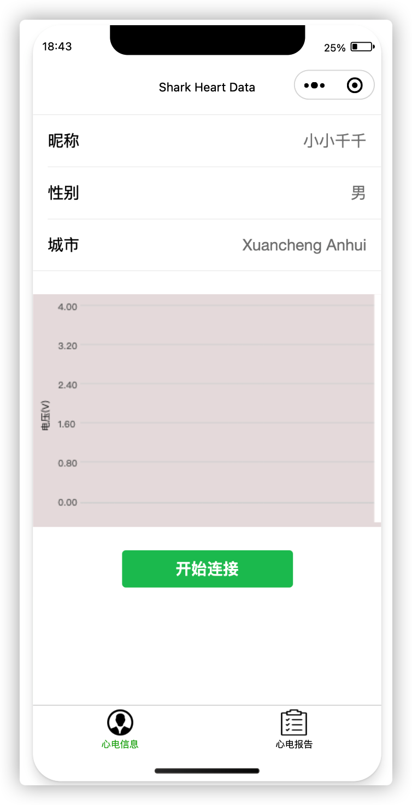

### 介绍

​	主页由个人信息、波形区域、操作按钮和底部tabbar组成。

- 个人信息。由登陆页面传过来的参数渲染而成。这里通过微信登陆传过来的昵称、性别、城市，进行展示。
- 波形区域，用来显示心电波形。
- 操作按钮。登陆小程序进入主页后，点击按钮会弹出对话框选择蓝牙进行连接，连接完成后，开始接受数据进行波形展示。
- 底部tabbar。有两个选项卡，主页和心电报告。

### 代码框架

- js

  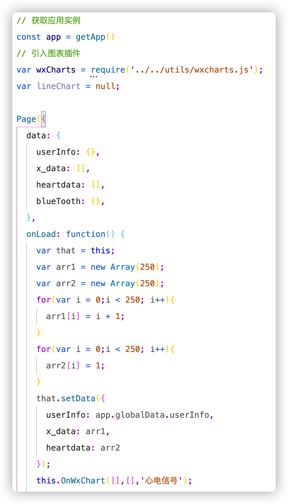

  userInfo为用户信息；heartdata初始化为1，后面实时显示时，进行数组移动即可，更新最后一个数。

  目前缺少蓝牙部分的连接逻辑。

- wxml

  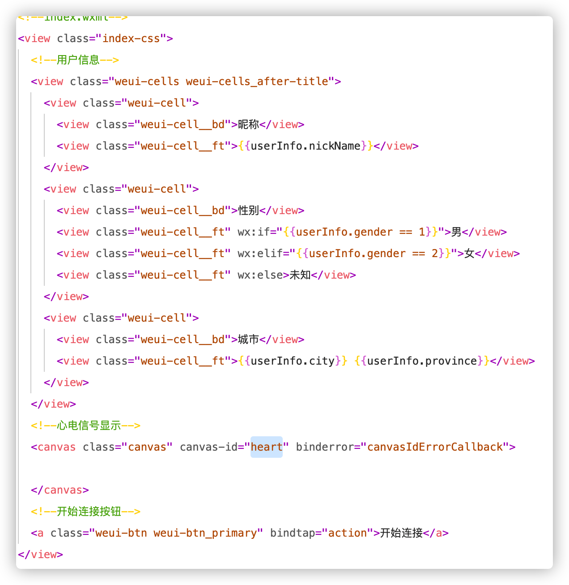

## 心电报告

​	用来查询用户的心电和健康的年度报告、月报告、日报告等信息。

### 报告主页

​	用来简述用户各年的情况。

#### 页面展示

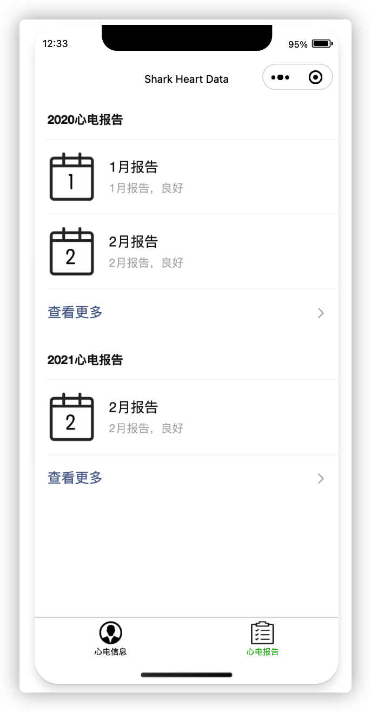

#### 介绍

- 报告主页由多个简略版年度报告组成
- 每个年度报告简略版包含最多两个月的月报告，一个超链接可以查看所有年度报告。
- 每个简略版月报告包含名称、简介月健康状况。

#### 报告格式

​	报告由服务端生成，并以JSON字符串格式发送到小程序。

```json
{ "data" : [
    {
      "year": "2020",
      "month": [
                 { "m": "1",
                   "imgurl": "/static/imgs/reports/riqi1.png",
                   "title": "1月报告",
                   "description": "1月报告，良好",
                   "analysis": {
                     "HealthIndex": "",
                     "Other": ""
                    },
                   "dayLists":[
                                { "d" : "31",
                                  "isUsed": "",
                                  "HealthIndex" : ""
                                }
                              ]
                  }
               ]
     }             
   ]
}
```

### 详细年度报告

​	详细展示该年所有使用设备的每个月的大概情况。

#### 页面展示

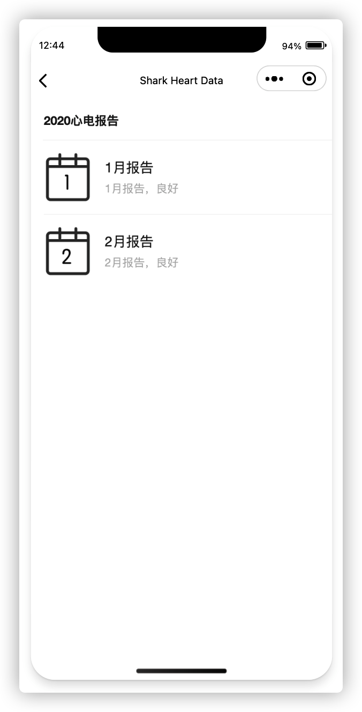

#### 介绍

	- 包含概念使用设备的，每个月的简略版月报告。

### 详细月报告

​	展示每个月的健康状况，和显示当月每天的大致情况。

#### 页面展示

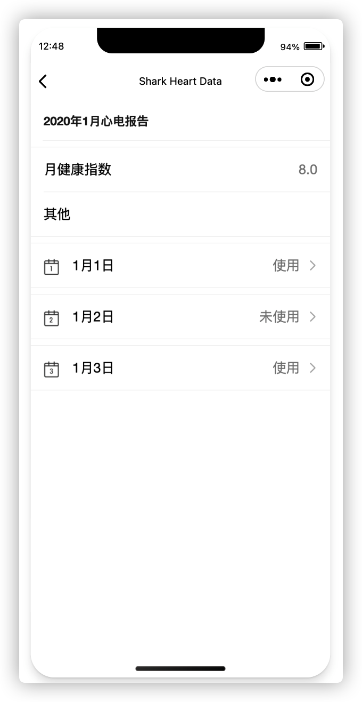

#### 介绍

- 包含当月的月健康指数和其他信息。
- 包含当月每天的是否使用过设备的简略信息。

#### 示例月报告

```json
{ "data" : [
             { 
               "year": "2020",
               "month": [
                    			{ "m": "1",
                      			"imgurl": "/static/imgs/reports/riqi1.png",
                      			"title": "1月报告",
                      			"description": "1月报告，良好",
                      			"analysis": {
                        									"HealthIndex": "8.0",
                        									"Other": ""
                      			},
                      			"dayLists":[
                        								{ "d" : "1",
                          								"imgurl": "/static/imgs/reports/riqi1.png",
                          								"isUsed": "true",
                          								"HealthIndex" : "9.9"
                        								},
                        								{ "d" : "2",
                          								"imgurl": "/static/imgs/reports/riqi2.png",
                          								"isUsed": "false",
                          								"HealthIndex" : ""
                        								},
                        								{ "d" : "3",
                          								"imgurl": "/static/imgs/reports/riqi3.png",
                          								"isUsed": "true",
                          								"HealthIndex" : "1.5"
                        								}
                      			]
                   				}
                 ]
               }
             	]
};
```

### 详细日报告

​	包含每日的大致健康状况，和每次使用设备的记录。

#### 页面展示

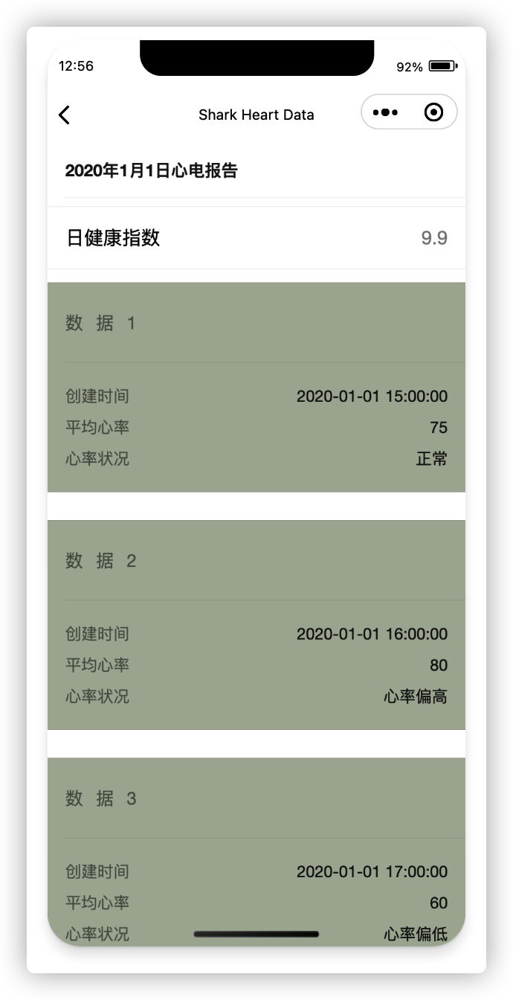

#### 介绍

- 包含当日健康状况描述和每次使用记录
- 每个使用记录包含名称、使用时间、健康状况。

#### 示例日报告

```json
{ "data" : [
            { 
              "year": "2020",
               "month": [
                        	{ "m": "1",
                      			"imgurl": "/static/imgs/reports/riqi1.png",
                      			"title": "1月报告",
                     				"description": "1月报告，良好",
                      			"analysis": {
                        									"HealthIndex": "8.0",
                        									"Other": ""
                      			},
                      			"dayLists":[
                        								{ "d" : "1",
                          								"imgurl": "/static/imgs/reports/riqi1.png",
                          								"isUsed": "true",
                          								"HealthIndex" : "9.9",
                          								"fileLists":[
                            														{
  																												"id": "1",
                              														"createdTime": "2020-01-01 15:00:00",
                              														"avgBeat": "75"
                            														},
                            														{
                                                          "id": "2",
                              														"createdTime": "2020-01-01 16:00:00",
                              														"avgBeat": "80"
                            														},
                            														{
                                                          "id": "3",
                              														"createdTime": "2020-01-01 17:00:00",
                              														"avgBeat": "60"
                            														}
                          														]
                        									}
                      			]
                    			}
                 ]
             }
          ]
};
```

# 服务端设计

​	主要包括用户登陆注册服务、文件传输和存储服务、健康报告服务。

## 用户服务设计

​	用户可以通过`微信`或者`账号密码`两种方式登陆。

​	目前仅支持微信登陆。

### 微信用户登陆/注册

​	用户通过小程序点击微信登陆后，将微信小程序用户临时验证码发送到服务器。服务器请求微信接口获取用户在该小程序下的openid，进行用户注册后返回openid给微信小程序。如图：


#### 小程序端发起请求

```js
// 与服务端交互
        wx.login({
          success (res) {
            if (res.code) {
              //发起网络请求
              // console.log(res);
              wx.request({
                url: app.globalData.domain + '/wxLogin',
                data: {
                  code: res.code,
                  nickName: app.globalData.userInfo.nickName,
                  avatarUrl: app.globalData.userInfo.avatarUrl,
                  gender: app.globalData.userInfo.gender,
                  city: app.globalData.userInfo.city,
                  province: app.globalData.userInfo.province
                },
                // 请求后端服务器成功回调
                // 服务端返回openId
                success(result){
                  // console.log(result.data);
                  if(result.data != "error"){
                    app.globalData.openid = result.data;
                    // console.log(app.globalData.openid);
                    wx.switchTab({
                      url: '/pages/index/index'
                    })
                  }else {
                    wx.showToast({
                      title: '登陆/注册失败',
                      icon: 'fail',
                      duration: 2000
                    });
                  }
                },
                // 请求后端服务器失败回调
                fail(res){
                  wx.showToast({
                    title: '登陆失败',
                    icon: 'fail',
                    duration: 2000
                  });
                }
              })
            } else {
              console.log('登录失败！' + res.errMsg)
            }
          }
        });
```

#### 数据库表

```mysql
CREATE TABLE `wxusers`  (
  `id` int(11) NOT NULL AUTO_INCREMENT COMMENT '主键（自增长）',
	`open_id` varchar(32) NOT NULL COMMENT '小程序openid',
  `nick_name` varchar(50) NOT NULL COMMENT '用户名',
  `avatar_url` varchar(500) NOT NULL COMMENT '密码，加密存储',
  `gender` int(10) NULL DEFAULT NULL COMMENT '登录Id',
	`city` varchar(32) NOT NULL COMMENT '城市',
	`province` varchar(32) NOT NULL COMMENT '省份',
  `created` timestamp(0) NOT NULL DEFAULT CURRENT_TIMESTAMP(0) COMMENT '自动插入，创建时间',
  PRIMARY KEY (`id`) USING BTREE,
	UNIQUE INDEX `open_id`(`open_id`) USING BTREE,
  INDEX `nick_name`(`nick_name`) USING BTREE
) ENGINE = InnoDB COMMENT = '微信用户表';
```

#### Dao层

```JAVA
public interface WxUserMapping {

	/*
	 * 插入一个微信用户
	 */
	@Insert("insert into `wxusers` (`open_id`, `nick_name`, `avatar_url`, `gender`, `city`, `province`) "
			+ "values(#{openId}, #{nickName}, #{avatarUrl}, #{gender}, #{city}, #{province})")
	public void insert(WxUserEntity wxUserEntity);
	
	/*
	 * 根据微信用户openId查询用户
	 * 这里不用返回用户所有信息，使用覆盖索引，提高效率
	 */
	@Select("select `open_id` from `wxusers` where `open_id`=#{openId}")
	public String getOpenId(@Param("openId") String openId);
	
	/*
	 * 根据openId查询id
	 */
	@Select("select `id` from `wxusers` where `open_id`=#{openId}")
	public int getIdByOpenId(String openId);
}
```

#### Service层

```java
public class WxUserService {

	@Autowired
	private WxUserMapping wxUserMapping;
	
	/*
	 * 添加用户
	 */
	public String addWxUser(WxUserEntity wxUserEntity) {
		if(wxUserEntity == null) {
			return Constants.FAILCODE;
		}
		try {
			wxUserMapping.insert(wxUserEntity);
			return Constants.SUCCESSCODE;
		} catch (Exception e) {
			// TODO: handle exception
			log.info("WxUserService/addWxUser", e);
			return Constants.FAILCODE;
		}
	}
	
	/*
	 * 根据openId判断是否是新用户
	 */
	public String isNewWxUser(String openId) {
		// 注意这里null和""的判读不能写反了。
		if(openId == null || openId.equals("")) {
			return Constants.SUCCESSCODE;
		}
		try {
			String res = wxUserMapping.getOpenId(openId);
			if(res == null || res.equals("")) {
				return Constants.SUCCESSCODE;
			}else {
				return Constants.FAILCODE;
			}
		} catch (Exception e) {
			// TODO: handle exception
			log.info("WxUserService/isNewWxUser", e);
			return Constants.ERROR;
		}
	}
	
	/*
	 * 根据用户openId查询id
	 */
	public int getId(String openId) {
		try {
			int id = wxUserMapping.getIdByOpenId(openId);
			log.info("WxUserService/getId, 查询ID成功," + id);
			return id;
		} catch (Exception e) {
			// TODO: handle exception
			log.info("WxUserService/getId, 查询ID失败", e);
			return -1;
		}
	}
}
```

#### Control层

```JAVA
public class WxUserController extends BaseController{

	@Autowired
	private RestTemplate restTemplate;
	
	/*
	 * 微信用户登陆/注册
	 */
	@RequestMapping("/wxLogin")
	public String wxLogin(WxUserEntity wxUserEntity, String code) {
		// 查询Redis是否存在用户
		// 这里好像不太能通过用户的微信信息来判断用户
		// 得想办法从客户端获取用户唯一识别码，方能通过redis缓存用户登陆信息。
		
		// 请求微信接口
		String params = "appid=" + Constants.APPID + "&secret=" + Constants.APPSECRET + "&js_code="
				+ code + "&grant_type=authorization_code";//参数
        String url = "https://api.weixin.qq.com/sns/jscode2session?"+params;// 微信接口 用于查询oponid
        String response = restTemplate.getForObject(url,String.class);
        JSONObject jsonObject = JSON.parseObject(response);
        response = jsonObject.getString("openid");
        log.info("UserController/wxLogin, 微信用户接口返回openid：" + response);
        wxUserEntity.setOpenId(response);
        // 是否是新添加用户
        String isNewWxUser = wxUserService.isNewWxUser(wxUserEntity.getOpenId());
        if(isNewWxUser.equals(Constants.SUCCESSCODE)) {
        	// 是新用户
            String addResult = wxUserService.addWxUser(wxUserEntity);
            if(addResult.equals(Constants.SUCCESSCODE)) {
            	// 添加成功
            	log.info("UserController/wxLogin, 新用户添加成功");
            }else {
            	// 添加失败
            	log.info("UserController/wxLogin, 新用户注册失败");
            	return Constants.ERROR;
            }
        }else if(isNewWxUser.equals(Constants.ERROR)) {
        	// 查询失败
        	log.info("UserController/wxLogin, 用户信息查询失败");
        	return Constants.ERROR;
        }
        log.info("UserController/wxLogin, 登陆/注册成功返回openid");
        return response;
	}
}
```

#### 测试

1. 第一次通过微信登陆，服务端进行新用户注册。

   服务端日志：

   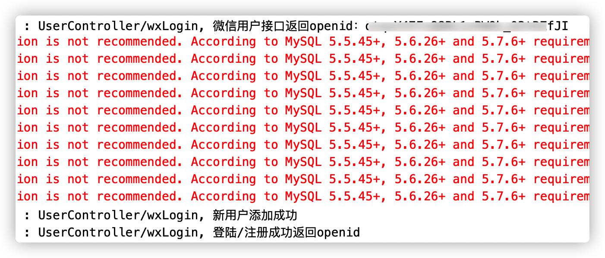

   数据库表插入了新纪录：

   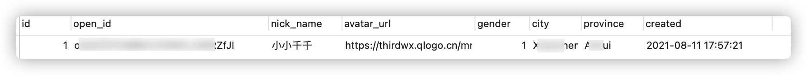
   
2. 第二次通过微信登陆，服务端直接返回openid

   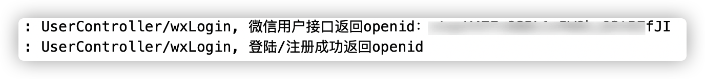

## 文件传输和存储服务

​	用户在使用设备期间，传输客户端存储的数据。可以使用文件传输形式或流传输形式。

​	暂时使用文件传输形式。

### 数据库表

```mysql
CREATE TABLE `file_info`  (
  `id` int(11) NOT NULL AUTO_INCREMENT COMMENT '主键（自增长）',
  `file_name` varchar(150) NOT NULL COMMENT '文件名称',
  `file_url` varchar(100)  NOT NULL COMMENT '文件url',
	`year` varchar(10) NOT NULL COMMENT '年份',
	`month` varchar(10) NOT NULL COMMENT '月份',
	`day` varchar(10) NOT NULL COMMENT '日',
  `pepole_id` int(11) NOT NULL COMMENT '所属人Id',
	`client_created` timestamp(6) NOT NULL COMMENT '客户端创建时间',
  `server_created` timestamp(0) NOT NULL DEFAULT CURRENT_TIMESTAMP(0) COMMENT '自动插入，服务器创建时间',
  PRIMARY KEY (`id`) USING BTREE,
  UNIQUE INDEX `file_name`(`file_name`) USING BTREE,
  INDEX `pepole_Id`(`pepole_Id`) USING BTREE,
	INDEX `year` (`year`) USING BTREE,
	INDEX `month` (`month`) USING BTREE,
	INDEX `day` (`day`) USING BTREE
) ENGINE = InnoDB COMMENT = '文件表';
```

其他部分，等小程序蓝牙部分测试完成后连调。

## 健康报告服务

​	用户在小程序页面点击健康报告后，请求服务器发送健康报告。健康报告分为主页报告、年度报告、月报告、日报告。

### 主页报告

​	主页报告是实现用户所有年份前两个月的缩率报告，缩略报告包括报告名称、简单描述等等。

#### 数据库表

主页报告需要查询月份报告数据库表，包含以下字段。

```mysql
CREATE TABLE `month_report`  (
  `id` int(11) NOT NULL AUTO_INCREMENT COMMENT '主键（自增长）',
	`y` int(10) NOT NULL COMMENT '年份名称',
  `m` int(10) NOT NULL COMMENT '月份名称',
  `imgurl` varchar(100)  NOT NULL COMMENT '图片url',
	`title` varchar(50) NOT NULL COMMENT '报告标题',
	`description` varchar(100) NOT NULL COMMENT '简要描述',
	`health_index` FLOAT(10) NOT NULL COMMENT '健康指标',
  `pepole_id` int(11) NOT NULL COMMENT '所属人Id',
  PRIMARY KEY (`id`) USING BTREE,
	INDEX `y` (`y`) USING BTREE,
	INDEX `m` (`m`) USING BTREE
) ENGINE = InnoDB COMMENT = '月份报告表';
```

#### Dao层

```java
public interface MonthReportMapping {

	/*
	 * 插入一个月份报告
	 */
	@Insert("insert into `month_report` values(#{y}, #{m}, #{imgurl}, #{title}, #{description}, #{healthIndex},"
			+ "#{pepoleId})")
	public void insertMonthReport(MonthReport monthReport);
	
	/*
	 * 判断月报告是否存在
	 */
	@Select("select id from `month_report` WHERE `y`=#{y} and `m`=#{m} and `pepole_id`=#{pepoleId}")
	public Integer isExist(@Param("y") int year, @Param("m") int month, @Param("pepoleId") int pepoleId);
	
	/*
	 * 根据年份查询所有月份前两个月报告
	 */
	@Select("select * from `month_report` WHERE `y`=#{y} and `pepole_id`=#{pepoleId}  ORDER BY m limit 2;")
	public List<MonthReport> getFront2months(@Param("y") int year, @Param("pepoleId") int pepoleId);
}

```

#### Service层

```java
	public String getSummryReport(String openId) {
		try {
			// 从redis中，用openId提取pepoleId
			// 。。。
			// 这里先直接从数据库查询
			int pepoleId = wxUserService.getId(openId);
			if (pepoleId == -1) {
				log.info("ReportService/getSummryReport, 用户openid查询失败，获取健康报告失败");
				return Constants.ERROR;
			}
			// 查询用户使用年份
			List<String> allYearsByPepoleId = fileMapping.getAllYearsByPepoleId(pepoleId);
			// 查询前两个月的信息并封装
			JSONObject report = new JSONObject();
			JSONArray yearArray = new JSONArray();
			for (String year : allYearsByPepoleId) {
				// 组合简略报告
				JSONObject smallYearReport = new JSONObject();
				smallYearReport.put(Constants.YEAR, year);

				JSONArray monthArray = new JSONArray();
				List<MonthReport> front2months = monthReportMapping.getFront2months(Integer.valueOf(year), pepoleId);
				for (MonthReport mR : front2months) {
					monthArray.add(Report.monthReportJSON(mR));
				}

				smallYearReport.put(Constants.MONTH, monthArray);
				yearArray.add(smallYearReport);
			}
			report.put(Constants.DATA, yearArray);
			log.info("ReportService/getSummryReport, 获取健康报告成功" + report.toJSONString());
			// 算法分析
			return report.toJSONString();
		} catch (Exception e) {
			// TODO: handle exception
			log.info("ReportService/getSummryReport, 获取健康报告失败", e);
			return Constants.ERROR;
		}
	}
```

#### Control层

```java
/*
	 * 查询用户健康报告首页
	 */
	@RequestMapping("/getReport")
	public String getReport(String openid) {
		// 查询用户是否存在
        String isNewWxUser = wxUserService.isNewWxUser(openid);
        if(isNewWxUser.equals(Constants.SUCCESSCODE)) {
        	// 是新用户           
            return Constants.FAILCODE;
        }else if(isNewWxUser.equals(Constants.ERROR)) {
        	// 查询失败
        	log.info("ReportController/getReport, 用户信息查询失败");
        	return Constants.ERROR;
        }
        String summryReport = reportService.getSummryReport(openid);
        if(summryReport.equals(Constants.ERROR)) {
        	log.info("ReportController/getReport, 报告获取失败");
        	return Constants.ERROR;
        }
        log.info("ReportController/getReport, 报告获取成功");
        return summryReport;
	}
```

#### 测试

​	在数据库中提前插入以下数据，用于测试。包含2020年最后两个月，和2021年前两个月数据。

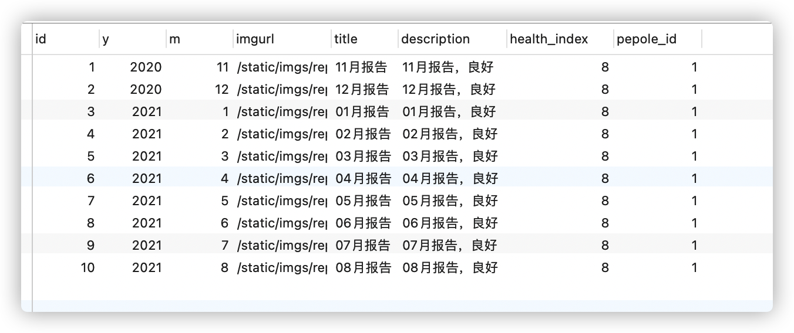

1. 本地测试

   浏览器访问服务器主页报告api，参数为用户openid

   

   回车后，浏览器以JSON字符串输出结果，和前述格式一致。

   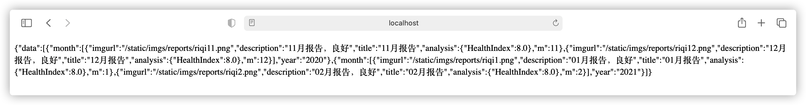

   本地测试正常。

2. 小程序测试

   小程序登陆后访问如下：

   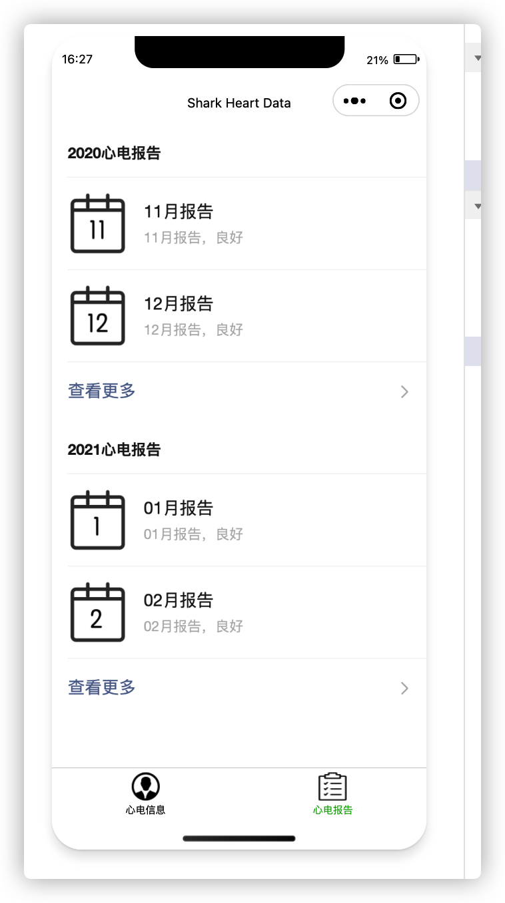

   小程序端访问正常。

### 年度报告

​	年度报告是实现用户当前年份所有月份的缩率报告。

#### Dao层

​	依然使用month_report表即可查询所有月份的缩率报告。

```java
public interface MonthReportMapping {

	// ...
  
	/*
	 * 根据年份查询所有月份的月报告
	 */
	@Select("select * from `month_report` WHERE `y`=#{y} and `pepole_id`=#{pepoleId}  ORDER BY m;")
	public List<MonthReport> getAllMonthsByYear(@Param("y") int year, @Param("pepoleId") int pepoleId);
}
```

#### Service层

```java
/*
	 * 根据openid/pepoleid查询某年所有月缩略报告
	 */
	public String getYearReport(String year, String openId) {
		try {
			// 从redis中，用openId提取pepoleId
			// 。。。
			// 这里先直接从数据库查询
			int pepoleId = wxUserService.getId(openId);
			if (pepoleId == -1) {
				log.info("ReportService/getYearReport, 用户openid查询失败，获取年度健康报告失败");
				return Constants.ERROR;
			}
			// 查询前两个月的信息并封装
			JSONObject report = new JSONObject();
			JSONArray yearArray = new JSONArray(); // 小程序端只使用数组的第一个值

			// 组合年度报告
			JSONObject yearReport = new JSONObject();
			yearReport.put(Constants.YEAR, year);

			JSONArray monthArray = new JSONArray();
			List<MonthReport> allMonthsByYear = monthReportMapping.getAllMonthsByYear(Integer.valueOf(year), pepoleId);
			for (MonthReport mR : allMonthsByYear) {
				monthArray.add(Report.monthReportJSON(mR));
			}

			yearReport.put(Constants.MONTH, monthArray);
			yearArray.add(yearReport);
			report.put(Constants.DATA, yearArray);
			log.info("ReportService/getYearReport, 获取年度健康报告成功" + report.toJSONString());
			// 算法分析
			return report.toJSONString();
		} catch (Exception e) {
			// TODO: handle exception
			log.info("ReportService/getYearReport, 获取年度健康报告失败", e);
			return Constants.ERROR;
		}
	}
```

#### Control层

```java
/*
	 * 查询用户年度健康报告
	 */
	@RequestMapping("/getYearReport")
	public String getYearReport(String year, String openid) {
		// 查询用户是否存在
        String isNewWxUser = wxUserService.isNewWxUser(openid);
        if(isNewWxUser.equals(Constants.SUCCESSCODE)) {
        	// 是新用户           
            return Constants.FAILCODE;
        }else if(isNewWxUser.equals(Constants.ERROR)) {
        	// 查询失败
        	log.info("ReportController/getYearReport, 用户信息查询失败");
        	return Constants.ERROR;
        }
        String yearReport = reportService.getYearReport(year, openid);
        if(yearReport.equals(Constants.ERROR)) {
        	log.info("ReportController/getYearReport, 报告获取失败");
        	return Constants.ERROR;
        }
        log.info("ReportController/getYearReport, 报告获取成功");
        return yearReport;
	}
```

#### 测试

​	测试数据依然是下列数据：


1. 本地测试

   浏览器访问服务器主页报告api，参数为用户openid，查询年份year

   

   回车后，浏览器以JSON字符串输出结果，和前述格式一致。

   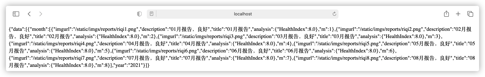

   本地测试结果正常。

2. 小程序测试

   小程序点击2021年的年度报告显示如下：

   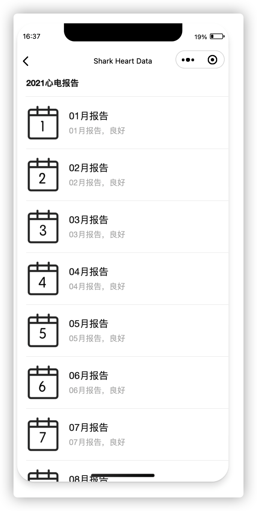

   小程序测试正常。

### 月报告

​	月报告是实现用户当前月份每天的缩率报告。日缩率报告包含名称、是否使用。

#### 数据库表

​	月报告需要查询日报告表，包含以下字段：

```mysql
CREATE TABLE `day_report`  (
  `id` int(11) NOT NULL AUTO_INCREMENT COMMENT '主键（自增长）',
	`y` int(10) NOT NULL COMMENT '年份名称',
  `m` int(10) NOT NULL COMMENT '月份名称',
	`d` int(10) NOT NULL COMMENT '天数名称',
  `imgurl` varchar(100)  NOT NULL COMMENT '图片url',
	`isUsed` tinyint(1) NOT NULL COMMENT '当日是否使用',
	`health_index` FLOAT(10) NOT NULL COMMENT '健康指标',
  `pepole_id` int(11) NOT NULL COMMENT '所属人Id',
  PRIMARY KEY (`id`) USING BTREE,
	INDEX `y` (`y`) USING BTREE,
	INDEX `m` (`m`) USING BTREE,
	INDEX `d` (`d`) USING BTREE
) ENGINE = InnoDB COMMENT = '日报告表';
```

#### Dao层

```java
public interface MonthReportMapping {

	// ...
  
	/*
	 * 查询某月的月报告
	 */
	@Select("select * from `month_report` WHERE `y`=#{y} and `m`=#{m} and `pepole_id`=#{pepoleId}")
	public MonthReport getMonthReportByYearAndMonth(@Param("y") int year, @Param("m") int month, @Param("pepoleId") int pepoleId);
}
```

```java
public interface DayReportMapping {

	/*
	 * 插入一个记录
	 */
	@Insert("insert into `day_report` values(#{y}, #{m}, #{d}, #{imgurl}, #{isUsed}, #{healthIndex},"
			+ "#{pepoleId})")
	public void insertDayReport(DayReport dayReport);
	
	/*
	 * 根据openid、year、month查询所有缩略日报告
	 */
	@Select("select * from `day_report` where `y`=#{y} and `m`=#{m} and `pepole_id`=#{pepoleId} ORDER BY d;")
	public List<DayReport> getAllDayReportByYearAndMonth(@Param("y") int year, @Param("m") int month, 
			@Param("pepoleId") int pepoleId);
}
```

#### Service层

```java
/*
	 * 根据openid/pepoleid查询某年某月所有天缩略报告
	 */
	public String getMonthReport(String year, String month, String openId) {
		try {
			// 从redis中，用openId提取pepoleId
			// 。。。
			// 这里先直接从数据库查询
			int pepoleId = wxUserService.getId(openId);
			if (pepoleId == -1) {
				log.info("ReportService/getMonthReport, 用户openid查询失败，获取年度健康报告失败");
				return Constants.ERROR;
			}
			// 查询该月所有“天报告”的信息并封装
			JSONObject report = new JSONObject();
			JSONArray yearArray = new JSONArray(); // 小程序端只使用数组的第一个值

			// 组合详细月报告
			JSONObject yearReport = new JSONObject();
			yearReport.put(Constants.YEAR, year);

			JSONArray monthArray = new JSONArray();
				// 查询该月报告
			MonthReport monthReportByYearAndMonth = monthReportMapping.getMonthReportByYearAndMonth(Integer.valueOf(year), 
					Integer.valueOf(month), pepoleId);
				// 查询该月所有日报告
			List<DayReport> allDayReportByYearAndMonth = dayReportMapping.getAllDayReportByYearAndMonth(Integer.valueOf(year), 
					Integer.valueOf(month), pepoleId);
			monthReportByYearAndMonth.setDayLists(allDayReportByYearAndMonth);
			monthArray.add(Report.monthReportJSON(monthReportByYearAndMonth));
			
			yearReport.put(Constants.MONTH, monthArray);
			yearArray.add(yearReport);
			report.put(Constants.DATA, yearArray);
			log.info("ReportService/getMonthReport, 获取详细月健康报告成功" + report.toJSONString());
			// 算法分析
			return report.toJSONString();
		} catch (Exception e) {
			// TODO: handle exception
			log.info("ReportService/getMonthReport, 获取详细月健康报告失败", e);
			return Constants.ERROR;
		}
	}
```

#### Control层

```java
/*
	 * 查询用户详细月健康报告
	 */
	@RequestMapping("/getMonthReport")
	public String getMonthReport(String year, String month, String openid) {
		// 查询用户是否存在
        String isNewWxUser = wxUserService.isNewWxUser(openid);
        if(isNewWxUser.equals(Constants.SUCCESSCODE)) {
        	// 是新用户           
            return Constants.FAILCODE;
        }else if(isNewWxUser.equals(Constants.ERROR)) {
        	// 查询失败
        	log.info("ReportController/getMonthReport, 用户信息查询失败");
        	return Constants.ERROR;
        }
        String monthReport = reportService.getMonthReport(year, month, openid);
        if(monthReport.equals(Constants.ERROR)) {
        	log.info("ReportController/getMonthReport, 报告获取失败");
        	return Constants.ERROR;
        }
        log.info("ReportController/getMonthReport, 报告获取成功");
        return monthReport;
	}
```

#### 测试

​	在数据库中提前插入以下数据，用于测试。包含2021年8月1-16号的数据。

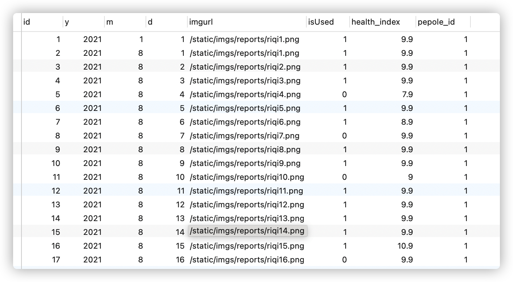

1. 本地测试

   浏览器访问服务器主页报告api，参数为用户openid，查询年份year，查询月份month。

   

   回车后，浏览器以JSON字符串输出结果，和前述格式一致。

   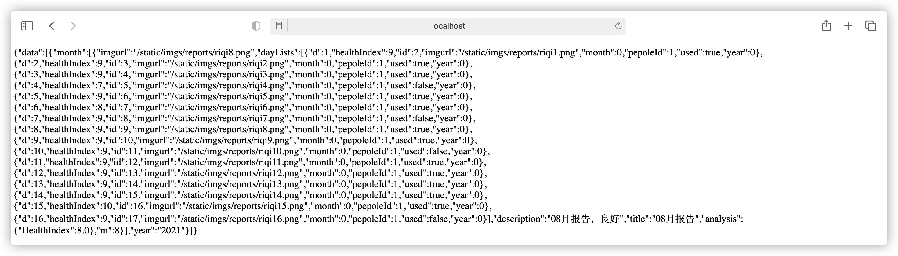

   本地测试正常。

2. 小程序测试

   小程序中点击2021年8月月报告后显示：

   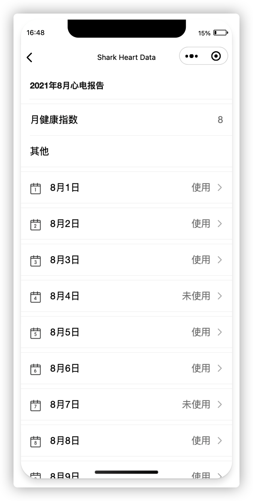

   小程序测试正常。

### 日报告

#### 测试

​	在数据库中提前插入以下数据，用于测试。包含2021年8月16号的3段数据。

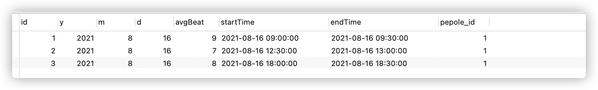

1. 本地测试

   浏览器访问服务器主页报告api，参数为用户openid，查询年份year，查询月份month，查询天数day。

   

   回车后，浏览器以JSON字符串输出结果，和前述格式一致。

   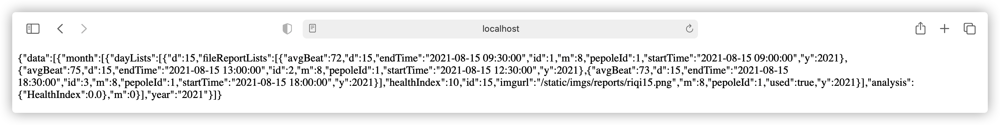

   本地测试正常。

2. 小程序测试

   小程序中点击2021年8月15日报告后显示：

   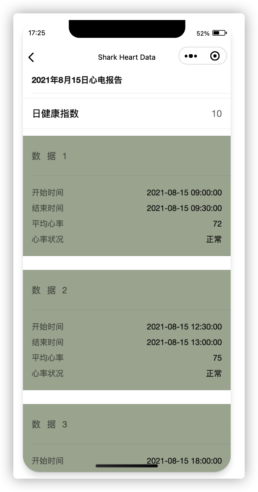

# 待开发/改进

1. 使用Redis缓存数据
2. lombok日志文件配置(完成)
3. 代码复用的改进，多抽离接口出来
4. mysql中浮点数存储失败
5. 小程序报告页面下拉刷新

# 开发笔记

1. 数据读取或者其他参数读取时，判断是否为null或者为""时，注意，null在前，""在后。

   ```java
   // 注意这里null和""的判读不能写反了。
   		if(openId == null || openId.equals("")) {
   			return Constants.SUCCESSCODE;
   		}
   ```

2. 数据库里面时间戳的定义timestamp后面的位数是设置ns的精度，一般不显示ns，就直接设置为0.

   ``endTime` timestamp(0) NOT NULL COMMENT '结束时间'`

3. 从数据库读取时间戳到JSON串时，一直无法显示yyyy-mm-dd格式时间。可以通过在Javabean上使用`@JSONField(format="yyyy-MM-dd HH:mm:ss")`注解指定格式，还可以指定JSON串中的其他属性。**注意设定日期时间格式时,HH指使用24小时制,hh是使用12小时制**。

