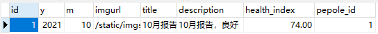

# HeartData
心电小程序客户端数据的服务器存储和分析

注意工程中，配置文件密码相关敏感信息已屏蔽，clone项目时需自行配置。

# 小程序系统架构

​	小程序主要分为登陆页面、主页、心电报告页面。其中主页和心电报告页面整合为带tabbar的页面。


## 登陆页面

​	用来登陆小程序。

### 页面展示


### 介绍

​	登陆页面由背景图片和登录按钮组成。

- 背景图片，设置铺满全屏。

- 登陆可以设置为"用户名 + 密码"形式登陆，也可以设置为微信登陆。

  目前采用微信方式登陆，点击按钮后，弹出弹窗，授权后可以获取到微信相关的信息：微信昵称、性别、地区。

  

### 代码框架

- js

  

  js部分后续还要加上将登陆信息发送到服务器部分。

  如果是微信登陆，需要在第一次登陆时发送信息。

  如果时"用户名+密码"方式登陆，则在注册时发送信息到服务器。

- wxml

  

## 主页

​	展示用户信息、通过蓝牙与硬件连接、实时显示波形。

### 页面展示


### 介绍

​	主页由个人信息、波形区域、操作按钮和底部tabbar组成。

- 个人信息。由登陆页面传过来的参数渲染而成。这里通过微信登陆传过来的昵称、性别、城市，进行展示。
- 波形区域，用来显示心电波形。
- 操作按钮。登陆小程序进入主页后，点击按钮会弹出对话框选择蓝牙进行连接，连接完成后，开始接受数据进行波形展示。
- 底部tabbar。有两个选项卡，主页和心电报告。

### 代码框架

- js

  

  userInfo为用户信息；heartdata初始化为1，后面实时显示时，进行数组移动即可，更新最后一个数。

  目前缺少蓝牙部分的连接逻辑。

- wxml

  

## 心电报告

​	用来查询用户的心电和健康的年度报告、月报告、日报告等信息。

### 报告主页

​	用来简述用户各年的情况。

#### 页面展示


#### 介绍

- 报告主页由多个简略版年度报告组成
- 每个年度报告简略版包含最多两个月的月报告，一个超链接可以查看所有年度报告。
- 每个简略版月报告包含名称、简介月健康状况。

#### 报告格式

​	报告由服务端生成，并以JSON字符串格式发送到小程序。

```json
{ "data" : [
    {
      "year": "2020",
      "month": [
                 { "m": "1",
                   "imgurl": "/static/imgs/reports/riqi1.png",
                   "title": "1月报告",
                   "description": "1月报告，良好",
                   "analysis": {
                     "HealthIndex": "",
                     "Other": ""
                    },
                   "dayLists":[
                                { "d" : "31",
                                  "isUsed": "",
                                  "HealthIndex" : ""
                                }
                              ]
                  }
               ]
     }             
   ]
}
```

### 详细年度报告

​	详细展示该年所有使用设备的每个月的大概情况。

#### 页面展示


#### 介绍

	- 包含概念使用设备的，每个月的简略版月报告。

### 详细月报告

​	展示每个月的健康状况，和显示当月每天的大致情况。

#### 页面展示


#### 介绍

- 包含当月的月健康指数和其他信息。
- 包含当月每天的是否使用过设备的简略信息。

#### 示例月报告

```json
{ "data" : [
             { 
               "year": "2020",
               "month": [
                    			{ "m": "1",
                      			"imgurl": "/static/imgs/reports/riqi1.png",
                      			"title": "1月报告",
                      			"description": "1月报告，良好",
                      			"analysis": {
                        									"HealthIndex": "8.0",
                        									"Other": ""
                      			},
                      			"dayLists":[
                        								{ "d" : "1",
                          								"imgurl": "/static/imgs/reports/riqi1.png",
                          								"isUsed": "true",
                          								"HealthIndex" : "9.9"
                        								},
                        								{ "d" : "2",
                          								"imgurl": "/static/imgs/reports/riqi2.png",
                          								"isUsed": "false",
                          								"HealthIndex" : ""
                        								},
                        								{ "d" : "3",
                          								"imgurl": "/static/imgs/reports/riqi3.png",
                          								"isUsed": "true",
                          								"HealthIndex" : "1.5"
                        								}
                      			]
                   				}
                 ]
               }
             	]
};
```

### 详细日报告

​	包含每日的大致健康状况，和每次使用设备的记录。

#### 页面展示


#### 介绍

- 包含当日健康状况描述和每次使用记录
- 每个使用记录包含名称、使用时间、健康状况。

#### 示例日报告

```json
{ "data" : [
            { 
              "year": "2020",
               "month": [
                        	{ "m": "1",
                      			"imgurl": "/static/imgs/reports/riqi1.png",
                      			"title": "1月报告",
                     				"description": "1月报告，良好",
                      			"analysis": {
                        									"HealthIndex": "8.0",
                        									"Other": ""
                      			},
                      			"dayLists":[
                        								{ "d" : "1",
                          								"imgurl": "/static/imgs/reports/riqi1.png",
                          								"isUsed": "true",
                          								"HealthIndex" : "9.9",
                          								"fileLists":[
                            														{
  																												"id": "1",
                              														"createdTime": "2020-01-01 15:00:00",
                              														"avgBeat": "75"
                            														},
                            														{
                                                          "id": "2",
                              														"createdTime": "2020-01-01 16:00:00",
                              														"avgBeat": "80"
                            														},
                            														{
                                                          "id": "3",
                              														"createdTime": "2020-01-01 17:00:00",
                              														"avgBeat": "60"
                            														}
                          														]
                        									}
                      			]
                    			}
                 ]
             }
          ]
};
```

# 小程序端JS逻辑设计

​	包括具体的蓝牙、数据存储、数据上传服务器、波形显示等部分逻辑设计

## 蓝牙

### 蓝牙搜索

​	在点击"开始连接"按钮后，弹出附件可连接的蓝牙设备。

1. js

   ```js
   ble: function () {
       // 显示蓝牙列表
       this.setData({
         showBluetoothDevices: true
         // bleLists: [{"deviceId":1, "name":2}]
       });
       // 搜索蓝牙
         // 初始化蓝牙模块
       wx.openBluetoothAdapter({
         success: function (res) {
           // 开始搜寻附近的蓝牙外围设备
           wx.startBluetoothDevicesDiscovery({
             services: [] // 要搜索的蓝牙设备主服务的 UUID 列表（支持 16/32/128 位 UUID）
           })
         }
       });
       // 获取在蓝牙模块生效期间所有搜索到的蓝牙设备。
       // 这里不用that会报错 why???
       var that = this;
       wx.getBluetoothDevices({
         success: function (res) {
           // success
           //{devices: Array[11], errMsg: "getBluetoothDevices:ok"}
           // console.log("getBluetoothDevices");
           // console.log(res);
           that.setData({
             bleLists: res.devices
           });
           // console.log(that.data.bleLists);
         }
       })
     },
   ```

2. 测试

   开发工具没有蓝牙测试权限，在iphone X测试如下：

   

   搜索蓝牙成功。

### 蓝牙连接

1. js

   ```js
     ble: function () {
       /**
        * 初始化蓝牙模块
        */
       wx.openBluetoothAdapter({
         success: function (res) {
           /**
            * 开始搜寻附近的蓝牙外围设备
            */ 
           wx.startBluetoothDevicesDiscovery({
             services: [] // 要搜索的蓝牙设备主服务的 UUID 列表（支持 16/32/128 位 UUID）
           })
         }
       });
       // 获取在蓝牙模块生效期间所有搜索到的蓝牙设备。
       var that = this;
       wx.getBluetoothDevices({
         success: function (res) {
           that.setData({
             bleLists: res.devices
           });
         }
       });
     },
       
    connectBle: function (e) {
       var that = this;
       /**
        * 监听蓝牙低功耗连接状态的改变事件。包括开发者主动连接或断开连接，设备丢失，连接异常断开等等
        */
       wx.onBLEConnectionStateChange(function (res) {
         console.log(`device ${res.deviceId} state has changed, connected: ${res.connected}`)
       });
       /** 
        * 连接蓝牙低功耗设备。若小程序在之前已有搜索过某个蓝牙设备，并成功建立连接，可直接传入之前搜索获取的 deviceId 直接尝试连接该设备，无需再次进行搜索操作。
        */
       wx.createBLEConnection({
         success: function () {
           /**
            * 连接成功后开始获取设备的服务列表(service)。
            */
           wx.getBLEDeviceServices({
               /**
                * 设定一个定时器。在定时到期以后执行注册的回调函数
                * 延迟3秒，根据服务获取特征 
                */
               setTimeout(
                 function () {
                   /**
                    * 获取蓝牙低功耗设备某个服务中所有特征 (characteristic)。
                    */
                   wx.getBLEDeviceCharacteristics({
                     success: function (res) {
                       /** 
                        * 获取设备特征列表
                        * 属性	       类型	   说明
                        * uuid	      string	蓝牙设备特征的 UUID
                        * properties	Object	该特征支持的操作类型
                        */
                       console.log('device getBLEDeviceCharacteristics:', res.characteristics);
                       /**
                        * 启用蓝牙低功耗设备特征值变化时的 notify 功能，订阅特征。注意：必须设备的特征支持 notify 或者 indicate 才可以成功调用。
                        * 顺序开发设备特征notifiy
                        */
                       wx.notifyBLECharacteristicValueChange({
                       });
                       /**
                        * 监听蓝牙低功耗设备的特征值变化事件。必须先调用 wx.notifyBLECharacteristicValueChange 接口才能接收到设备推送的 notification。
                        * 回调获取 设备发过来的数据
                        */
                       wx.onBLECharacteristicValueChange(function (characteristic) {
                       });
                     }
                   });
                 },
                 1500);
             }
           })
         }
       });
     },
   ```

   2. 测试

      以上图搜索到我的ipad为例，点击连接:

      

      在Mac的开发工具上蓝牙功能不能正常使用，下图使用Iphone x进行测试。红色方框为蓝牙所有的服务列表和对应的uuid，蓝色方框为选中服务（默认选择了第一个，具体使用时可配置）的特征uuid列表。


### 蓝牙传输

​	由于小程序只支持BLE，不能在手机等传统蓝牙模式下进行数据测试，后续测试等到校后使用硬件设备测试即可。现整理原app的蓝牙部分连接逻辑如下：


## 小程序数据流传输

​	利用http1.1的keep-alive模式，保持http长连接，采用单点数据直接上传服务器的数据流方式。

流传输测试代码：

```js
//测试数据流传输服务
  testTransport: function () {
    // var data = new Array(); 
    // data = this.heartdata;
    // for(var i = 0; i < 250 - 1; i++){
    //   data[i] = data[i + 1];
    // }
    // data[250 - 1] = cnt;
    // this.setData({
    //   heartdata: data
    // });
    // 向服务器发送数据
    wx.request({
      url: app.globalData.domain + '/recieveData',
      header: {
        'Connection': 'keep-alive'
      },
      data: {
        onedata: cnt,
        pepoleid: app.globalData.pepoleid,
        filepath: app.globalData.filepath
      },
      success(res){
        if(res.data == '500'){
          // 关闭蓝牙连接
          // ....
          // 提示错误
          wx.showToast({
            title: '数据传输服务器失败',
            icon: 'fail',
            duration: 2000
          });
        }else {
          // 存储当前服务器文件路径
          app.globalData.filepath = res.data;
        }
      }
    });
    // test
    if(cnt > 5){
      flag = true;
    }else if(cnt < 1){
      flag = false
    }
    if(flag){
      cnt--;
    }else{
      cnt++;
    }
  },
```

# 服务端设计

​	主要包括用户登陆注册服务、文件传输和存储服务、健康报告服务。

## 用户服务设计

​	用户可以通过`微信`或者`账号密码`两种方式登陆。

​	目前仅支持微信登陆。

### 微信用户登陆/注册

​	用户通过小程序点击微信登陆后，将微信小程序用户临时验证码发送到服务器。服务器请求微信接口获取用户在该小程序下的openid，进行用户注册后返回openid给微信小程序。如图：


#### 小程序端发起请求

```js
// 与服务端交互
        wx.login({
          success (res) {
            if (res.code) {
              //发起网络请求
              // console.log(res);
              wx.request({
                url: app.globalData.domain + '/wxLogin',
                data: {
                  code: res.code,
                  nickName: app.globalData.userInfo.nickName,
                  avatarUrl: app.globalData.userInfo.avatarUrl,
                  gender: app.globalData.userInfo.gender,
                  city: app.globalData.userInfo.city,
                  province: app.globalData.userInfo.province
                },
                // 请求后端服务器成功回调
                // 服务端返回openId
                success(result){
                  // console.log(result.data);
                  if(result.data != "error"){
                    app.globalData.openid = result.data;
                    // console.log(app.globalData.openid);
                    wx.switchTab({
                      url: '/pages/index/index'
                    })
                  }else {
                    wx.showToast({
                      title: '登陆/注册失败',
                      icon: 'fail',
                      duration: 2000
                    });
                  }
                },
                // 请求后端服务器失败回调
                fail(res){
                  wx.showToast({
                    title: '登陆失败',
                    icon: 'fail',
                    duration: 2000
                  });
                }
              })
            } else {
              console.log('登录失败！' + res.errMsg)
            }
          }
        });
```

#### 数据库表

```mysql
CREATE TABLE `wxusers`  (
  `id` int(11) NOT NULL AUTO_INCREMENT COMMENT '主键（自增长）',
	`open_id` varchar(32) NOT NULL COMMENT '小程序openid',
  `nick_name` varchar(50) NOT NULL COMMENT '用户名',
  `avatar_url` varchar(500) NOT NULL COMMENT '密码，加密存储',
  `gender` int(10) NULL DEFAULT NULL COMMENT '登录Id',
	`city` varchar(32) NOT NULL COMMENT '城市',
	`province` varchar(32) NOT NULL COMMENT '省份',
  `created` timestamp(0) NOT NULL DEFAULT CURRENT_TIMESTAMP(0) COMMENT '自动插入，创建时间',
  PRIMARY KEY (`id`) USING BTREE,
	UNIQUE INDEX `open_id`(`open_id`) USING BTREE,
  INDEX `nick_name`(`nick_name`) USING BTREE
) ENGINE = InnoDB COMMENT = '微信用户表';
```

#### Dao层

```JAVA
public interface WxUserMapping {

	/*
	 * 插入一个微信用户
	 */
	@Insert("insert into `wxusers` (`open_id`, `nick_name`, `avatar_url`, `gender`, `city`, `province`) "
			+ "values(#{openId}, #{nickName}, #{avatarUrl}, #{gender}, #{city}, #{province})")
	public void insert(WxUserEntity wxUserEntity);
	
	/*
	 * 根据微信用户openId查询用户
	 * 这里不用返回用户所有信息，使用覆盖索引，提高效率
	 */
	@Select("select `open_id` from `wxusers` where `open_id`=#{openId}")
	public String getOpenId(@Param("openId") String openId);
	
	/*
	 * 根据openId查询id
	 */
	@Select("select `id` from `wxusers` where `open_id`=#{openId}")
	public int getIdByOpenId(String openId);
}
```

#### Service层

```java
public class WxUserService {

	@Autowired
	private WxUserMapping wxUserMapping;
	
	/*
	 * 添加用户
	 */
	public String addWxUser(WxUserEntity wxUserEntity) {
		if(wxUserEntity == null) {
			return Constants.FAILCODE;
		}
		try {
			wxUserMapping.insert(wxUserEntity);
			return Constants.SUCCESSCODE;
		} catch (Exception e) {
			// TODO: handle exception
			log.info("WxUserService/addWxUser", e);
			return Constants.FAILCODE;
		}
	}
	
	/*
	 * 根据openId判断是否是新用户
	 */
	public String isNewWxUser(String openId) {
		// 注意这里null和""的判读不能写反了。
		if(openId == null || openId.equals("")) {
			return Constants.SUCCESSCODE;
		}
		try {
			String res = wxUserMapping.getOpenId(openId);
			if(res == null || res.equals("")) {
				return Constants.SUCCESSCODE;
			}else {
				return Constants.FAILCODE;
			}
		} catch (Exception e) {
			// TODO: handle exception
			log.info("WxUserService/isNewWxUser", e);
			return Constants.ERROR;
		}
	}
	
	/*
	 * 根据用户openId查询id
	 */
	public int getId(String openId) {
		try {
			int id = wxUserMapping.getIdByOpenId(openId);
			log.info("WxUserService/getId, 查询ID成功," + id);
			return id;
		} catch (Exception e) {
			// TODO: handle exception
			log.info("WxUserService/getId, 查询ID失败", e);
			return -1;
		}
	}
}
```

#### Control层

```JAVA
public class WxUserController extends BaseController{

	@Autowired
	private RestTemplate restTemplate;
	
	/*
	 * 微信用户登陆/注册
	 */
	@RequestMapping("/wxLogin")
	public String wxLogin(WxUserEntity wxUserEntity, String code) {
		// 查询Redis是否存在用户
		// 这里好像不太能通过用户的微信信息来判断用户
		// 得想办法从客户端获取用户唯一识别码，方能通过redis缓存用户登陆信息。
		
		// 请求微信接口
		String params = "appid=" + Constants.APPID + "&secret=" + Constants.APPSECRET + "&js_code="
				+ code + "&grant_type=authorization_code";//参数
        String url = "https://api.weixin.qq.com/sns/jscode2session?"+params;// 微信接口 用于查询oponid
        String response = restTemplate.getForObject(url,String.class);
        JSONObject jsonObject = JSON.parseObject(response);
        response = jsonObject.getString("openid");
        log.info("UserController/wxLogin, 微信用户接口返回openid：" + response);
        wxUserEntity.setOpenId(response);
        // 是否是新添加用户
        String isNewWxUser = wxUserService.isNewWxUser(wxUserEntity.getOpenId());
        if(isNewWxUser.equals(Constants.SUCCESSCODE)) {
        	// 是新用户
            String addResult = wxUserService.addWxUser(wxUserEntity);
            if(addResult.equals(Constants.SUCCESSCODE)) {
            	// 添加成功
            	log.info("UserController/wxLogin, 新用户添加成功");
            }else {
            	// 添加失败
            	log.info("UserController/wxLogin, 新用户注册失败");
            	return Constants.ERROR;
            }
        }else if(isNewWxUser.equals(Constants.ERROR)) {
        	// 查询失败
        	log.info("UserController/wxLogin, 用户信息查询失败");
        	return Constants.ERROR;
        }
        log.info("UserController/wxLogin, 登陆/注册成功返回openid");
        return response;
	}
}
```

#### 测试

1. 第一次通过微信登陆，服务端进行新用户注册。

   服务端日志：

   

   数据库表插入了新纪录：

   
   
2. 第二次通过微信登陆，服务端直接返回openid

   

## 文件/数据流传输和存储服务

​	用户在使用设备期间，传输客户端存储的数据。可以使用文件传输形式或流传输形式。

​	暂时使用文件传输形式。

### 数据库表

```mysql
CREATE TABLE `file_info`  (
  `id` int(11) NOT NULL AUTO_INCREMENT COMMENT '主键（自增长）',
  `file_name` varchar(150) NOT NULL COMMENT '文件名称',
  `file_url` varchar(100)  NOT NULL COMMENT '文件url',
	`year` varchar(10) NOT NULL COMMENT '年份',
	`month` varchar(10) NOT NULL COMMENT '月份',
	`day` varchar(10) NOT NULL COMMENT '日',
  `pepole_id` int(11) NOT NULL COMMENT '所属人Id',
	`client_created` timestamp(6) NOT NULL COMMENT '客户端创建时间',
  `server_created` timestamp(0) NOT NULL DEFAULT CURRENT_TIMESTAMP(0) COMMENT '自动插入，服务器创建时间',
  PRIMARY KEY (`id`) USING BTREE,
  UNIQUE INDEX `file_name`(`file_name`) USING BTREE,
  INDEX `pepole_Id`(`pepole_Id`) USING BTREE,
	INDEX `year` (`year`) USING BTREE,
	INDEX `month` (`month`) USING BTREE,
	INDEX `day` (`day`) USING BTREE
) ENGINE = InnoDB COMMENT = '文件表';
```

### Dao层

```java
public interface FileMapping {

	/*
	 * 插入一个文件
	 */
	@Insert("insert into `file_info` (`file_name`, `file_url`, `year`, `month`, `day`,"
			+ " `pepole_id`, `client_created`) "
			+ "values(#{fileName}, #{fileUrl}, #{year}, #{month}, #{day}"
			+ ", #{pepoleId}, #{clientCreated});")
	public void addFile(FileEntity fileEntity);
  
}
```

### Service层

```java
public class FileService extends BaseService{

	@Value("${fileBasePath}")
	private String fileBasePath;
	@Autowired
	private ThreadPoolExecutor threadPoolExecutor;

	/*
	 * 将数据插入文件
	 */
	public String saveData(HttpServletRequest req, int onedata, int pepoleid, String filepath) {
		// 判读是否需要新建文件
		String res = "";
		BufferedOutputStream out = null;
		try {
			if(filepath == null || filepath.equals("")) {
				String time = TimeUtil.getCurrentTime();
				String[] strs = time.split(" ");
				// fileName格式：pepoleId_yy-mm-dd_hh_mm_ss_.txt 0_2021-07-29_16_38_01_.txt
				String[] hours = strs[1].split(":");
				String filename = pepoleid + "_" + strs[0] + "_" + hours[0] + "_" 
							  + hours[1] + "_" + hours[2] + "_.txt";
				// 文件名存Session
				String[] arr = strs[0].split("-");
				String path = fileBasePath + pepoleid + "/" + arr[0] + "/" + arr[1] + "/" + arr[2];
				isExist(path);
				filepath = path + "/" + filename;
			}
			out = new BufferedOutputStream(new FileOutputStream(new File(filepath), true));
			// 这里写入文件不能直接写int会没有反应。
			out.write(String.valueOf(onedata).getBytes());
			out.flush();
			log.info("FileService/saveData, 写入文件成功");
			res = filepath;
		} catch (Exception e) {
			log.info("FileService/saveData, 写入文件失败", e);
			res = Constants.FAILCODE;
		} finally {
			try {
				out.close();
			} catch (IOException e) {
				log.info("FileService/saveData, 关闭文件失败", e);
				res = Constants.FAILCODE;
			}
		}
		return res;
	}

	private void isExist(String path) {
		File folder = new File(path);
		if (!folder.exists() && !folder.isDirectory()) {
			folder.mkdirs();
			log.info("创建文件夹: " + path);
		}
	}
}
```

### Control层

```java
/*
	 * 接收一个数据点
	 */
	@RequestMapping("/recieveData")
	public String recieveData(HttpServletRequest req, int onedata, int pepoleid, String filepath) {
		String res = fileService.saveData(req, onedata, pepoleid, filepath);
		return res;
	}
```

### 测试

1. 本地测试

   访问特定url，从浏览器选择文件上传到服务器接口：

   

   上传完成后，可以在本地磁盘和数据库中看到结果：

   

   小程序端测试

2. 小程序测试

   小程序采用数据流方式传输数据，在服务器生成文件。
   
   小程序点击主页的测试按钮，会在0-6之间递增递减传送。
   
   
   
   不断点击可以看到服务器生成文件并填入数据：
   
   
   
   
   
   小程序流传输正常


## 健康报告服务

​	用户在小程序页面点击健康报告后，请求服务器发送健康报告。健康报告分为主页报告、年度报告、月报告、日报告。

### 主页报告

​	主页报告是实现用户所有年份前两个月的缩率报告，缩略报告包括报告名称、简单描述等等。

#### 数据库表

主页报告需要查询月份报告数据库表，包含以下字段。

```mysql
CREATE TABLE `month_report`  (
  `id` int(11) NOT NULL AUTO_INCREMENT COMMENT '主键（自增长）',
	`y` int(10) NOT NULL COMMENT '年份名称',
  `m` int(10) NOT NULL COMMENT '月份名称',
  `imgurl` varchar(100)  NOT NULL COMMENT '图片url',
	`title` varchar(50) NOT NULL COMMENT '报告标题',
	`description` varchar(100) NOT NULL COMMENT '简要描述',
	`health_index` FLOAT(10) NOT NULL COMMENT '健康指标',
  `pepole_id` int(11) NOT NULL COMMENT '所属人Id',
  PRIMARY KEY (`id`) USING BTREE,
	INDEX `y` (`y`) USING BTREE,
	INDEX `m` (`m`) USING BTREE
) ENGINE = InnoDB COMMENT = '月份报告表';
```

#### Dao层

```java
public interface MonthReportMapping {

	/*
	 * 插入一个月份报告
	 */
	@Insert("insert into `month_report` values(#{y}, #{m}, #{imgurl}, #{title}, #{description}, #{healthIndex},"
			+ "#{pepoleId})")
	public void insertMonthReport(MonthReport monthReport);
	
	/*
	 * 判断月报告是否存在
	 */
	@Select("select id from `month_report` WHERE `y`=#{y} and `m`=#{m} and `pepole_id`=#{pepoleId}")
	public Integer isExist(@Param("y") int year, @Param("m") int month, @Param("pepoleId") int pepoleId);
	
	/*
	 * 根据年份查询所有月份前两个月报告
	 */
	@Select("select * from `month_report` WHERE `y`=#{y} and `pepole_id`=#{pepoleId}  ORDER BY m limit 2;")
	public List<MonthReport> getFront2months(@Param("y") int year, @Param("pepoleId") int pepoleId);
}

```

#### Service层

```java
	public String getSummryReport(String openId) {
		try {
			// 从redis中，用openId提取pepoleId
			// 。。。
			// 这里先直接从数据库查询
			int pepoleId = wxUserService.getId(openId);
			if (pepoleId == -1) {
				log.info("ReportService/getSummryReport, 用户openid查询失败，获取健康报告失败");
				return Constants.ERROR;
			}
			// 查询用户使用年份
			List<String> allYearsByPepoleId = fileMapping.getAllYearsByPepoleId(pepoleId);
			// 查询前两个月的信息并封装
			JSONObject report = new JSONObject();
			JSONArray yearArray = new JSONArray();
			for (String year : allYearsByPepoleId) {
				// 组合简略报告
				JSONObject smallYearReport = new JSONObject();
				smallYearReport.put(Constants.YEAR, year);

				JSONArray monthArray = new JSONArray();
				List<MonthReport> front2months = monthReportMapping.getFront2months(Integer.valueOf(year), pepoleId);
				for (MonthReport mR : front2months) {
					monthArray.add(Report.monthReportJSON(mR));
				}

				smallYearReport.put(Constants.MONTH, monthArray);
				yearArray.add(smallYearReport);
			}
			report.put(Constants.DATA, yearArray);
			log.info("ReportService/getSummryReport, 获取健康报告成功" + report.toJSONString());
			// 算法分析
			return report.toJSONString();
		} catch (Exception e) {
			// TODO: handle exception
			log.info("ReportService/getSummryReport, 获取健康报告失败", e);
			return Constants.ERROR;
		}
	}
```

#### Control层

```java
/*
	 * 查询用户健康报告首页
	 */
	@RequestMapping("/getReport")
	public String getReport(String openid) {
		// 查询用户是否存在
        String isNewWxUser = wxUserService.isNewWxUser(openid);
        if(isNewWxUser.equals(Constants.SUCCESSCODE)) {
        	// 是新用户           
            return Constants.FAILCODE;
        }else if(isNewWxUser.equals(Constants.ERROR)) {
        	// 查询失败
        	log.info("ReportController/getReport, 用户信息查询失败");
        	return Constants.ERROR;
        }
        String summryReport = reportService.getSummryReport(openid);
        if(summryReport.equals(Constants.ERROR)) {
        	log.info("ReportController/getReport, 报告获取失败");
        	return Constants.ERROR;
        }
        log.info("ReportController/getReport, 报告获取成功");
        return summryReport;
	}
```

#### 测试

​	在数据库中提前插入以下数据，用于测试。包含2020年最后两个月，和2021年前两个月数据。


1. 本地测试

   浏览器访问服务器主页报告api，参数为用户openid

   

   回车后，浏览器以JSON字符串输出结果，和前述格式一致。

   

   本地测试正常。

2. 小程序测试

   小程序登陆后访问如下：

   

   小程序端访问正常。

### 年度报告

​	年度报告是实现用户当前年份所有月份的缩率报告。

#### Dao层

​	依然使用month_report表即可查询所有月份的缩率报告。

```java
public interface MonthReportMapping {

	// ...
  
	/*
	 * 根据年份查询所有月份的月报告
	 */
	@Select("select * from `month_report` WHERE `y`=#{y} and `pepole_id`=#{pepoleId}  ORDER BY m;")
	public List<MonthReport> getAllMonthsByYear(@Param("y") int year, @Param("pepoleId") int pepoleId);
}
```

#### Service层

```java
/*
	 * 根据openid/pepoleid查询某年所有月缩略报告
	 */
	public String getYearReport(String year, String openId) {
		try {
			// 从redis中，用openId提取pepoleId
			// 。。。
			// 这里先直接从数据库查询
			int pepoleId = wxUserService.getId(openId);
			if (pepoleId == -1) {
				log.info("ReportService/getYearReport, 用户openid查询失败，获取年度健康报告失败");
				return Constants.ERROR;
			}
			// 查询前两个月的信息并封装
			JSONObject report = new JSONObject();
			JSONArray yearArray = new JSONArray(); // 小程序端只使用数组的第一个值

			// 组合年度报告
			JSONObject yearReport = new JSONObject();
			yearReport.put(Constants.YEAR, year);

			JSONArray monthArray = new JSONArray();
			List<MonthReport> allMonthsByYear = monthReportMapping.getAllMonthsByYear(Integer.valueOf(year), pepoleId);
			for (MonthReport mR : allMonthsByYear) {
				monthArray.add(Report.monthReportJSON(mR));
			}

			yearReport.put(Constants.MONTH, monthArray);
			yearArray.add(yearReport);
			report.put(Constants.DATA, yearArray);
			log.info("ReportService/getYearReport, 获取年度健康报告成功" + report.toJSONString());
			// 算法分析
			return report.toJSONString();
		} catch (Exception e) {
			// TODO: handle exception
			log.info("ReportService/getYearReport, 获取年度健康报告失败", e);
			return Constants.ERROR;
		}
	}
```

#### Control层

```java
/*
	 * 查询用户年度健康报告
	 */
	@RequestMapping("/getYearReport")
	public String getYearReport(String year, String openid) {
		// 查询用户是否存在
        String isNewWxUser = wxUserService.isNewWxUser(openid);
        if(isNewWxUser.equals(Constants.SUCCESSCODE)) {
        	// 是新用户           
            return Constants.FAILCODE;
        }else if(isNewWxUser.equals(Constants.ERROR)) {
        	// 查询失败
        	log.info("ReportController/getYearReport, 用户信息查询失败");
        	return Constants.ERROR;
        }
        String yearReport = reportService.getYearReport(year, openid);
        if(yearReport.equals(Constants.ERROR)) {
        	log.info("ReportController/getYearReport, 报告获取失败");
        	return Constants.ERROR;
        }
        log.info("ReportController/getYearReport, 报告获取成功");
        return yearReport;
	}
```

#### 测试

​	测试数据依然是下列数据：


1. 本地测试

   浏览器访问服务器主页报告api，参数为用户openid，查询年份year

   

   回车后，浏览器以JSON字符串输出结果，和前述格式一致。

   

   本地测试结果正常。

2. 小程序测试

   小程序点击2021年的年度报告显示如下：

   

   小程序测试正常。

### 月报告

​	月报告是实现用户当前月份每天的缩率报告。日缩率报告包含名称、是否使用。

#### 数据库表

​	月报告需要查询日报告表，包含以下字段：

```mysql
CREATE TABLE `day_report`  (
  `id` int(11) NOT NULL AUTO_INCREMENT COMMENT '主键（自增长）',
	`y` int(10) NOT NULL COMMENT '年份名称',
  `m` int(10) NOT NULL COMMENT '月份名称',
	`d` int(10) NOT NULL COMMENT '天数名称',
  `imgurl` varchar(100)  NOT NULL COMMENT '图片url',
	`isUsed` tinyint(1) NOT NULL COMMENT '当日是否使用',
	`health_index` FLOAT(10) NOT NULL COMMENT '健康指标',
  `pepole_id` int(11) NOT NULL COMMENT '所属人Id',
  PRIMARY KEY (`id`) USING BTREE,
	INDEX `y` (`y`) USING BTREE,
	INDEX `m` (`m`) USING BTREE,
	INDEX `d` (`d`) USING BTREE
) ENGINE = InnoDB COMMENT = '日报告表';
```

#### Dao层

```java
public interface MonthReportMapping {

	// ...
  
	/*
	 * 查询某月的月报告
	 */
	@Select("select * from `month_report` WHERE `y`=#{y} and `m`=#{m} and `pepole_id`=#{pepoleId}")
	public MonthReport getMonthReportByYearAndMonth(@Param("y") int year, @Param("m") int month, @Param("pepoleId") int pepoleId);
}
```

```java
public interface DayReportMapping {

	/*
	 * 插入一个记录
	 */
	@Insert("insert into `day_report` values(#{y}, #{m}, #{d}, #{imgurl}, #{isUsed}, #{healthIndex},"
			+ "#{pepoleId})")
	public void insertDayReport(DayReport dayReport);
	
	/*
	 * 根据openid、year、month查询所有缩略日报告
	 */
	@Select("select * from `day_report` where `y`=#{y} and `m`=#{m} and `pepole_id`=#{pepoleId} ORDER BY d;")
	public List<DayReport> getAllDayReportByYearAndMonth(@Param("y") int year, @Param("m") int month, 
			@Param("pepoleId") int pepoleId);
}
```

#### Service层

```java
/*
	 * 根据openid/pepoleid查询某年某月所有天缩略报告
	 */
	public String getMonthReport(String year, String month, String openId) {
		try {
			// 从redis中，用openId提取pepoleId
			// 。。。
			// 这里先直接从数据库查询
			int pepoleId = wxUserService.getId(openId);
			if (pepoleId == -1) {
				log.info("ReportService/getMonthReport, 用户openid查询失败，获取年度健康报告失败");
				return Constants.ERROR;
			}
			// 查询该月所有“天报告”的信息并封装
			JSONObject report = new JSONObject();
			JSONArray yearArray = new JSONArray(); // 小程序端只使用数组的第一个值

			// 组合详细月报告
			JSONObject yearReport = new JSONObject();
			yearReport.put(Constants.YEAR, year);

			JSONArray monthArray = new JSONArray();
				// 查询该月报告
			MonthReport monthReportByYearAndMonth = monthReportMapping.getMonthReportByYearAndMonth(Integer.valueOf(year), 
					Integer.valueOf(month), pepoleId);
				// 查询该月所有日报告
			List<DayReport> allDayReportByYearAndMonth = dayReportMapping.getAllDayReportByYearAndMonth(Integer.valueOf(year), 
					Integer.valueOf(month), pepoleId);
			monthReportByYearAndMonth.setDayLists(allDayReportByYearAndMonth);
			monthArray.add(Report.monthReportJSON(monthReportByYearAndMonth));
			
			yearReport.put(Constants.MONTH, monthArray);
			yearArray.add(yearReport);
			report.put(Constants.DATA, yearArray);
			log.info("ReportService/getMonthReport, 获取详细月健康报告成功" + report.toJSONString());
			// 算法分析
			return report.toJSONString();
		} catch (Exception e) {
			// TODO: handle exception
			log.info("ReportService/getMonthReport, 获取详细月健康报告失败", e);
			return Constants.ERROR;
		}
	}
```

#### Control层

```java
/*
	 * 查询用户详细月健康报告
	 */
	@RequestMapping("/getMonthReport")
	public String getMonthReport(String year, String month, String openid) {
		// 查询用户是否存在
        String isNewWxUser = wxUserService.isNewWxUser(openid);
        if(isNewWxUser.equals(Constants.SUCCESSCODE)) {
        	// 是新用户           
            return Constants.FAILCODE;
        }else if(isNewWxUser.equals(Constants.ERROR)) {
        	// 查询失败
        	log.info("ReportController/getMonthReport, 用户信息查询失败");
        	return Constants.ERROR;
        }
        String monthReport = reportService.getMonthReport(year, month, openid);
        if(monthReport.equals(Constants.ERROR)) {
        	log.info("ReportController/getMonthReport, 报告获取失败");
        	return Constants.ERROR;
        }
        log.info("ReportController/getMonthReport, 报告获取成功");
        return monthReport;
	}
```

#### 测试

​	在数据库中提前插入以下数据，用于测试。包含2021年8月1-16号的数据。


1. 本地测试

   浏览器访问服务器主页报告api，参数为用户openid，查询年份year，查询月份month。

   

   回车后，浏览器以JSON字符串输出结果，和前述格式一致。

   

   本地测试正常。

2. 小程序测试

   小程序中点击2021年8月月报告后显示：

   

   小程序测试正常。

### 日报告

#### 数据库表

	日报告需要查询文件报告表，包含以下字段：

```mysql
CREATE TABLE `file_report`  (
  `id` int(11) NOT NULL AUTO_INCREMENT COMMENT '主键（自增长）',
	`y` int(10) NOT NULL COMMENT '年份名称',
  `m` int(10) NOT NULL COMMENT '月份名称',
	`d` int(10) NOT NULL COMMENT '天数名称',
	`avgBeat` FLOAT(10) NOT NULL COMMENT '健康指标',
	`startTime` timestamp(0) NOT NULL COMMENT '开始时间',
	`endTime` timestamp(0) NOT NULL COMMENT '结束时间',
  `pepole_id` int(11) NOT NULL COMMENT '所属人Id',
  PRIMARY KEY (`id`) USING BTREE,
	INDEX `y` (`y`) USING BTREE,
	INDEX `m` (`m`) USING BTREE,
	INDEX `d` (`d`) USING BTREE,
	INDEX `startTime` (`startTime`) USING BTREE,
	INDEX `pepole_id` (`pepole_id`) USING BTREE
) ENGINE = InnoDB COMMENT = '文件报告表';
```

#### 文件JavaBean

```java
@Setter
@Getter
public class FileReport {
	private int id;
	private int y;
	private int m;
	private int d;
	private int avgBeat;
	@JSONField(format="yyyy-MM-dd HH:mm:ss")//首先设定日期时间格式,HH指使用24小时制,hh是使用12小时制
	private Timestamp startTime;
	@JSONField(format="yyyy-MM-dd HH:mm:ss")
	private Timestamp endTime;
	private int pepoleId;
}
```

#### Dao层

```java
public interface FileReportMapping {

	/*
	 * 插入一个记录
	 */
	@Insert("insert into `file_report` values(null, #{y}, #{m}, #{d}, #{avgBeat}, "
			+ "#{startTime}, #{endTime}, #{pepoleId});")
	public void insert(FileReport filReport);
	
	/*
	 * 查询某天的所有文件记录
	 */
	@Select("select * from `file_report` where `y`=#{y} and `m`=#{m} and `d`=#{d} and "
			+ "`pepole_id`=#{pepoleId} ORDER BY `startTime`;")
	public List<FileReport> getAllFileReport(@Param("y") int year, @Param("m") int month, @Param("d") int day,
			@Param("pepoleId") int pepoleId);
}
```

```java
public interface DayReportMapping {

	//...
	
	/*
	 * 根据openid、year、month、day查询当日报告
	 */
	@Select("select * from `day_report` where `y`=#{y} and `m`=#{m} and `d`=#{d} and `pepole_id`=#{pepoleId};")
	public DayReport getDayReportByYearAndMonthAndDay(@Param("y") int year, @Param("m") int month, @Param("d") int day,
			@Param("pepoleId") int pepoleId);
}
```

#### Service层

```java
/*
	 * 根据openid/pepoleid查询某年某月某天所有的文件报告
	 */
	public String getDayReport(String year, String month, String day, String openId) {
		try {
			// 从redis中，用openId提取pepoleId
			// 。。。
			// 这里先直接从数据库查询
			int pepoleId = wxUserService.getId(openId);
			if (pepoleId == -1) {
				log.info("ReportService/getDayReport, 用户openid查询失败，获取年度健康报告失败");
				return Constants.ERROR;
			}
			// 查询某天所有文件报告的信息并封装
			JSONObject report = new JSONObject();
			
				// 组合年报告
			JSONObject yearReport = new JSONObject();
			yearReport.put(Constants.YEAR, year);
			
				// 组合月报告
					// 新建月报告，月报告信息不用传输客户端，不查询数据库
			MonthReport monthReportByYearAndMonth = new MonthReport();
					// 查询该月该日报告
			DayReport dayReportByYearAndMonthAndDay = dayReportMapping.getDayReportByYearAndMonthAndDay(Integer.valueOf(year), 
					Integer.valueOf(month), Integer.valueOf(day), pepoleId);
					// 查询改日所有文件报告
			List<FileReport> allFileReport = fileReportMapping.getAllFileReport(Integer.valueOf(year), 
					Integer.valueOf(month), Integer.valueOf(day), pepoleId);
					// 组合字段
			dayReportByYearAndMonthAndDay.setFileReportLists(allFileReport);
			List<DayReport> dayLists = new ArrayList<DayReport>();
			dayLists.add(dayReportByYearAndMonthAndDay);
			monthReportByYearAndMonth.setDayLists(dayLists);
			JSONArray monthArray = new JSONArray();
			monthArray.add(Report.toReportJSON(monthReportByYearAndMonth));
			
			yearReport.put(Constants.MONTH, monthArray);
			JSONArray yearArray = new JSONArray(); // 小程序端只使用数组的第一个值
			yearArray.add(yearReport);
			report.put(Constants.DATA, yearArray);
			log.info("ReportService/getDayReport, 获取详细日健康报告成功" + report.toJSONString());
			// 算法分析
			return report.toJSONString();
		} catch (Exception e) {
			// TODO: handle exception
			log.info("ReportService/getMonthReport, 获取详细日健康报告失败", e);
			return Constants.ERROR;
		}
	}
```

#### Control层

```java
/*
	 * 查询用户详细日健康报告
	 */
	@RequestMapping("/getDayReport")
	public String getDayReport(String year, String month, String day, String openid) {
		// 查询用户是否存在
        String isNewWxUser = wxUserService.isNewWxUser(openid);
        if(isNewWxUser.equals(Constants.SUCCESSCODE)) {
        	// 是新用户           
            return Constants.FAILCODE;
        }else if(isNewWxUser.equals(Constants.ERROR)) {
        	// 查询失败
        	log.info("ReportController/getDayReport, 用户信息查询失败");
        	return Constants.ERROR;
        }
        String dayReport = reportService.getDayReport(year, month, day, openid);
        if(dayReport.equals(Constants.ERROR)) {
        	log.info("ReportController/getDayReport, 报告获取失败");
        	return Constants.ERROR;
        }
        log.info("ReportController/getDayReport, 报告获取成功");
        return dayReport;
	}
```

#### 测试

	在数据库中提前插入以下数据，用于测试。包含2021年8月16号的3段数据。


1. 本地测试

   浏览器访问服务器主页报告api，参数为用户openid，查询年份year，查询月份month，查询天数day。

   

   回车后，浏览器以JSON字符串输出结果，和前述格式一致。

   

   本地测试正常。

2. 小程序测试

   小程序中点击2021年8月15日报告后显示：

   

## 数据分析和自动报告生成

### 数据分析

### 自动报告生成

#### 设计

- 数据分析和处理

​	采用子线程的方式进行数据的分析和处理

```java
	public void generateReport() {
		/**
		 * 遍历file_info数据库，搜素当天新添的所有文件
		 */
		// 1. 获取当前时间
		String time = TimeUtil.getCurrentTime();
		String[] strs = time.split(" ");// yy-mm-dd hh_mm_ss
		String[] ymd = strs[0].split("-"); // yy mm dd
		String[] hours = strs[1].split(":"); // hh mm ss
		// 查询当天文件
		List<FileEntity> filesListByYMD = fileMapping.getFilesListByYMD(ymd[0], ymd[1], ymd[2]);
		log.info("FileService/generateReport, 查询当天新添报告成功 {}", filesListByYMD);
		Runnable reportRunable = new ReportRunable(filesListByYMD, fileReportMapping, dayReportMapping,
				monthReportMapping, wxUserService);
		threadPoolExecutor.submit(reportRunable);
		log.info("生成报告中。。");
	}
```

- 子线程

```java
public void run() {
		// TODO Auto-generated method stub
		// 遍历filesToday列表，插入file_report数据库表
		Map<Integer, List<FileReport>> map = new HashMap<Integer, List<FileReport>>();
		int[] ymd = new int[3];
		for (FileEntity f : this.filesToday) {
			// 封装fileReport
			FileReport fileReport = new FileReport();
			fileReport.setY(Integer.valueOf(f.getYear()));
			fileReport.setM(Integer.valueOf(f.getMonth()));
			fileReport.setD(Integer.valueOf(f.getDay()));
			ymd[0] = fileReport.getY();
			ymd[1] = fileReport.getM();
			ymd[2] = fileReport.getD();
			fileReport.setStartTime(f.getClientCreated());
			fileReport.setEndTime(f.getServerCreated());
			fileReport.setPepoleId(f.getPepoleId());
			// 读取磁盘文件，计算平均心率
			// try {
			fileReport.setAvgBeat(calAvgHeart(f.getFileUrl()));
			// } catch (Exception e) {
			// // TODO: handle exception
			// // 若文件不存在或读取失败，则直接赋值为-1进行报错提示。
			// fileReport.setAvgBeat(-1);
			// log.info("ReportRunable/run, 读取文件失败", e);
			// }
			// try {
			fileReportMapping.insert(fileReport);
			log.info("ReportRunable/run, 插入fileReport成功");
			// } catch (Exception e) {
			// // TODO: handle exception
			// log.info("ReportRunable/run, 插入fileReport失败", e);
			// }
			if (!map.containsKey(f.getPepoleId())) {
				map.put(f.getPepoleId(), new ArrayList<FileReport>());
			}
			map.get(f.getPepoleId()).add(fileReport);
		}
		// 获取数据库所有人的id
		List<Integer> allPepoleId = wxUserService.getAllId();
		// 日报告生成和修改..
		for (Integer pid : allPepoleId) {
			DayReport dayReport = new DayReport();
			dayReport.setY(ymd[0]);
			dayReport.setM(ymd[1]);
			dayReport.setD(ymd[2]);
			dayReport.setImgurl("/static/imgs/reports/riqi" + ymd[2] + ".png");
			dayReport.setPepoleId(pid);
			if (!map.containsKey(pid)) {
				// 今天没有新增
				dayReport.setUsed(false);
				dayReport.setHealthIndex(0);
			} else {
				// 今天新增
				dayReport.setUsed(true);
				// 计算平均心率
				float dayAvg = 0;
				for (FileReport fr : map.get(pid)) {
					if (fr.getAvgBeat() == -1) {
						dayAvg = -1;
						break;
					}
					dayAvg += fr.getAvgBeat();
				}
				if (dayAvg != -1) {
					dayReport.setHealthIndex(dayAvg / map.get(pid).size());
				}
			}
			// try {
			dayReportMapping.insertDayReport(dayReport);
			log.info("ReportRunable/run, 插入dayReport成功");
			// } catch (Exception e) {
			// // TODO: handle exception
			// log.info("ReportRunable/run, 插入dayReport失败", e);
			// }
		}
		// 月报告生成和修改
		// try {
		for (Integer pid : allPepoleId) {
			// 查询本月每天的记录
			List<DayReport> allDayReportByYearAndMonth = dayReportMapping.getAllDayReportByYearAndMonth(ymd[0], ymd[1],
					pid);
			// 计算平均心率
			float monthAvg = 0;
			int len = 0;
			for (DayReport dr : allDayReportByYearAndMonth) {
				if (dr.isUsed()) {
					if (dr.getHealthIndex() == -1) {
						monthAvg = -1;
						break;
					}
				}
				monthAvg += dr.getHealthIndex();
				len = len + 1;
			}
			if (monthAvg != -1) {
				monthAvg = monthAvg / len;
			}
			if (ymd[2] == 1) {
				// 今天是新的1个月，需要进行新增月报告
				MonthReport monthReport = new MonthReport();
				monthReport.setY(ymd[0]);
				monthReport.setM(ymd[1]);
				monthReport.setImgurl("/static/imgs/reports/riqi" + ymd[1] + ".png");
				monthReport.setTitle(ymd[1] + "月报告");
				monthReport.setDescription("良好");
				monthReport.setPepoleId(pid);
				monthReport.setHealthIndex(monthAvg);
				monthReportMapping.insertMonthReport(monthReport);
				log.info("ReportRunable/run, 插入monthReport成功");
			} else {
				// 本月月报告已经存在，需要进行修改
				monthReportMapping.updateMonthHealthIndex(monthAvg, ymd[0], ymd[1], pid);
				log.info("ReportRunable/run, 修改monthReport成功");
			}
		}
		// } catch (Exception e) {
		// // TODO: handle exception
		// log.info("ReportRunable/run, 插入monthReport失败", e);
		// }
	}
```

#### 定时设计

​	使用springboot自带的`@Scheduled`注解即可。

​	暂定每天22:00:00进行当天数据的分析和报告的生成。

```java
@Scheduled(cron="0 0 22 * * ?")
```

#### 测试

1. 原数据库表

   - 月报告表

   

   - 日报告表

   

   - 文件报告表

     

2.  测试

   本地磁盘中已经存储了今天的2个测试数据如图。

   

   访问api进行测试：

   

   

   运行后结果正确，如下：

   - 文件报告表

     

   - 日报告表

     

   - 月报告表

     

   数据插入和修改完全正常，后续需要注意对子线程中异常回滚的事务情况。

# Linux服务器部署

分为JDK部署、MySQL数据库部署、后台运行jar包项目

## java环境和JDK部署

centos环境自带jdk1.8.0版本，为了与其他用户环境一致，暂时不更改。

但可能随着系统的更新导致服务不可用，后续再进行JDK的单独部署。

## MySQL部署

- 下载MySQL安装包

   1. 首先需要查询本机centos或其他Linux版本信息

      输入`lsb_release -a`

   2. 在官网https://dev.mysql.com/downloads/mysql下载对应版本

      - 可以现在bundle版本的，如mysql-8.0.15-1.el7.x86_64.rpm-bundle.tar。
      - 也可以单独下载各个模块：common –>client-plugs –> libs –> client –> server。

- 安装Mysql

   按照common –>client-plugs –> libs –> client –> server顺序进行安装。

   使用命令`rpm -ivh ***.rpm`进行模块的安装。

   > 注意：
   >
   > 当提示“mariadb-libs 被 mysql-community-libs-8.0.15-1.el7.x86_64 取代”，是lib和系统自带的冲突。使用命令`yum remove mysql-libs -y`后再使用`rpm -ivh ***` 命令继续安装。

- MySQL的root密码和相关权限设置

   1. 首先执行`service mysqld restart`指令重启mysql服务，为了后面查看日志里面的默认root密码。

      ```shell
      [root@localhost /]# service mysqld restart
      Redirecting to /bin/systemctl restart mysqld.service
      [root@localhost /]# /bin/systemctl restart mysqld.service
      ```

      select this shell

   2. 查看日志默认密码，mysql的日志在`/var/log/mysqld.log`里面

      ```shell
      [root@localhost log]# cat mysqld.log 
       .... A temporary password is generated for root@localhost: #+Tp!)#Fv6e;
      ```

      select this shell

   3. 修改登陆密码

      ```shell
      [root@localhost /]# mysql -u root -p
      Enter password: 
      Welcome to the MySQL monitor.  Commands end with ; or \g.
      Your MySQL connection id is 13
      Server version: 8.0.15
      Copyright (c) 2000, 2019, Oracle and/or its affiliates. All rights reserved.
      Oracle is a registered trademark of Oracle Corporation and/or its
      affiliates. Other names may be trademarks of their respective
      owners.
      Type 'help;' or '\h' for help. Type '\c' to clear the current input statement.
      mysql>  ALTER USER 'root'@'localhost' IDENTIFIED BY '...@...123';
      ```

      select this shell

      注意这里密码有复杂度的要求，尽量设置复杂一点并好记忆的密码～

   4. 开放所有ip地址都能访问：

      ```shell
      CREATE USER 'root'@'%' IDENTIFIED BY 'root123';
      ```

      select this shell

      root123是你自己设置的密码，若执行开放指定ip能访问，把%换成ip地址。

   5. 修改加密方式：

      ```shell
      ALTER USER 'root'@'%' IDENTIFIED WITH mysql_native_password BY 'root123';
      ```

      select this shell

      MySQL8默认是caching_sha2_password

   6. 开放防火墙端口 查看防火墙开放的端口。`firewall-cmd --zone=public --list-ports` 开启防火墙端口3306：`firewall-cmd --zone=public --add-port=3306/tcp --permanent`

- 远程连接数据库授权

   1. 创建时间数据库

      ```shell
      CREATE SCHEMA `testd_atabase` DEFAULT CHARACTER SET utf8
      ```

      select this shell

   2. 授权

      ```shell
      grant all on *.* to 'root'@'%';
      ```

      select this shell

   3. grant权限修改

      ```shell
      update mysql.user set Grant_priv='Y',Super_priv='Y' ;
      ```

## 后台运行jar包

- jar包位置/home/shark/Project/HeartData/Pub/HeartData-reportAndDatatransport-Linux-v0.1.2.jar

> 注意事项：
>
> Linux访问微信网关有问题，将微信用户登录时的openid改为uuid生产
>
> 更新记录：后续实验中发现回复了访问权限，继续使用微信网关返回的opendi

- jar包后台运行

  port: 8080

  ```shell
  nohup java -jar HeartData-reportAndDatatransport-Linux-v0.1.1.jar >heartdata.log 2>&1 &
  ```

- 访问日志

  微信登录、年报告查阅、月报告查阅、日报告查阅功能测试正常。


# 待开发/改进

1. 使用Redis缓存数据
2. lombok日志文件配置(☑️)
3. 代码复用的改进，多抽离接口出来
4. mysql中浮点数存储失败(☑️)
5. 小程序报告页面下拉刷新
6. 小程序蓝牙连接
7. 文件或数据流上传(☑️)
8. 小程序动态显示波形(☑️)
9. 从文件中生成报告的算法
10. 小程序和服务器接口的openid改为peopleid(☑️)
11. 自动报告生成的异常回滚

# 开发笔记

1. 数据读取或者其他参数读取时，判断是否为null或者为""时，注意，null在前，""在后。

   ```java
   // 注意这里null和""的判读不能写反了。
   		if(openId == null || openId.equals("")) {
   			return Constants.SUCCESSCODE;
   		}
   ```

2. 数据库里面时间戳的定义timestamp后面的位数是设置ns的精度，一般不显示ns，就直接设置为0.

   ``endTime` timestamp(0) NOT NULL COMMENT '结束时间'`

3. 从数据库读取时间戳到JSON串时，一直无法显示yyyy-mm-dd格式时间。可以通过在Javabean上使用`@JSONField(format="yyyy-MM-dd HH:mm:ss")`注解指定格式，还可以指定JSON串中的其他属性。**注意设定日期时间格式时,HH指使用24小时制,hh是使用12小时制**。

4. Java写本地磁盘文件，可能需要先转为byte数组才能成功写入

   ```java
   // 这里写入文件不能直接写int会没有反应。
   out.write(String.valueOf(onedata).getBytes());
   ```


5. 小程序在手机上访问时，因为有网络请求，需要开启：
   - 手机开启调试模式
   - 域名不可以为localhost，可以开启内网工具映射
